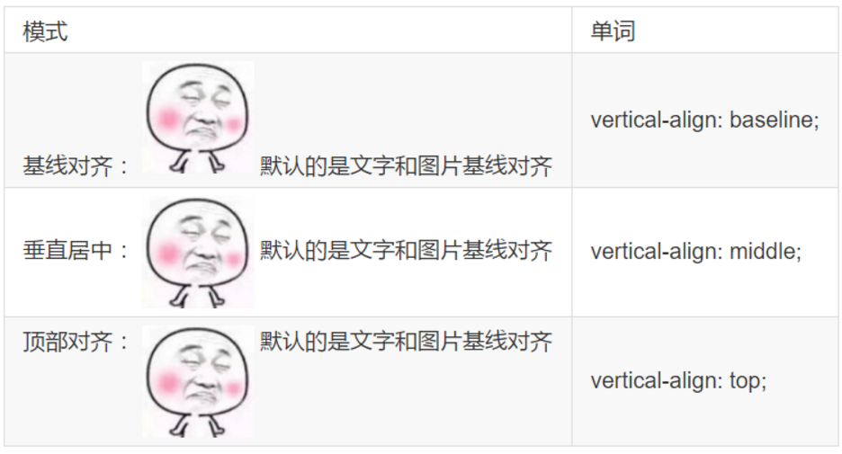

# CSS高级技巧

目标：

* 能说出元素显示隐藏最常见的写法
* 能写出最常见的鼠标样式
* 能说出精灵图产生的目的
* 能使用精灵图技术
* 能用滑动门做导航栏案例

## 1. 元素的显示与隐藏

在CSS中有三个显示和隐藏的单词比较常见，我们要区分开，他们分别是 display visibility 和 overflow。

他们的主要目的是让一个元素在页面中消失，但是不在文档源码中删除。 最常见的是网站广告，当我们点击类似关闭不见了，但是我们重新刷新页面，它们又会出现和你玩躲猫猫！！

### display 显示

display 设置或检索对象是否及如何显示。

display : none 隐藏对象 与它相反的是 display:block 除了转换为块级元素之外，同时还有显示元素的意思。

特点： 隐藏之后，不再保留位置。

### visibility 可见性

设置或检索是否显示对象。

visible : 　对象可视

hidden : 　对象隐藏

特点： 隐藏之后，继续保留原有位置。（停职留薪）

### overflow 溢出

检索或设置当对象的内容超过其指定高度及宽度时如何管理内容。

visible : 　不剪切内容也不添加滚动条。

auto : 　 超出自动显示滚动条，不超出不显示滚动条

hidden : 　不显示超过对象尺寸的内容，超出的部分隐藏掉

scroll : 　不管超出内容否，总是显示滚动条

## 2. CSS用户界面样式

 所谓的界面样式， 就是更改一些用户操作样式， 比如 更改用户的鼠标样式， 表单轮廓等。但是比如滚动条的样式改动受到了很多浏览器的抵制，因此我们就放弃了。 防止表单域拖拽

### 鼠标样式cursor

 设置或检索在对象上移动的鼠标指针采用何种系统预定义的光标形状。 

```html
cursor :  default  小白 | pointer  小手  | move  移动  |  text  文本
```

 鼠标放我身上查看效果哦：

```html
<ul>
  <li style="cursor:default">我是小白</li>
  <li style="cursor:pointer">我是小手</li>
  <li style="cursor:move">我是移动</li>
  <li style="cursor:text">我是文本</li>
  <li style="cursor:not-allowed">我是文本</li>
</ul>
```

### 轮廓 outline

 是绘制于元素周围的一条线，位于边框边缘的外围，可起到突出元素的作用。

```css
 outline : outline-color ||outline-style || outline-width 
```

 但是我们都不关心可以设置多少，我们平时都是去掉的。

最直接的写法是 ：  outline: 0;   或者  outline: none;

```html
 <input  type="text"  style="outline: 0;"/>
```

### 防止拖拽文本域resize

resize：none    这个单词可以防止 火狐 谷歌等浏览器随意的拖动 文本域。

右下角可以拖拽： 

<textarea></textarea>

右下角不可以拖拽： 

```html
<textarea  style="resize: none;"></textarea>
```

## 4. 溢出的文字隐藏

### white-space

white-space设置或检索对象内文本显示方式。通常我们使用于强制一行显示内容 

normal : 　默认处理方式
nowrap : 　强制在同一行内显示所有文本，直到文本结束或者遭遇br标签对象才换行。

可以处理中文

### text-overflow 文字溢出

text-overflow : clip | ellipsis

设置或检索是否使用一个省略标记（...）标示对象内文本的溢出

clip : 　不显示省略标记（...），而是简单的裁切 

ellipsis : 　当对象内文本溢出时显示省略标记（...）

注意一定要首先强制一行内显示，再次和overflow属性  搭配使用

**使用三部曲：**

 *1. 先强制一行内显示文本*/

      white-space: nowrap;
*2. 超出的部分隐藏*/
      overflow: hidden;
 *3. 文字用省略号替代超出的部分*/
      text-overflow: ellipsis;

## 3. vertical-align 行内块垂直对齐方式

以前我们讲过让带有宽度的块级元素居中对齐，是margin: 0 auto;

以前我们还讲过让文字居中对齐，是 text-align: center;

但是我们从来没有讲过有垂直居中的属性， 我们的妈妈一直很担心我们的垂直居中怎么做。

vertical-align 垂直对齐， 这个看上去很美好的一个属性， 实际有着不可捉摸的脾气，否则我们也不会这么晚来讲解。


```css
vertical-align : baseline |top |middle |bottom 
```

设置或检索对象内容的垂直对其方式。 

vertical-align 不影响块级元素中的内容对齐，它只针对于 行内元素或者行内块元素，特别是行内块元素， **通常用来控制图片/表单与文字的对齐**。




### 图片、表单和文字对齐

所以我们知道，我们可以通过vertical-align 控制图片和文字的垂直关系了。 默认的图片会和文字基线对齐。

### 去除图片底侧空白缝隙

有个很重要特性你要记住： 图片或者表单等行内块元素，他的底线会和父级盒子的基线对齐。这样会造成一个问题，就是图片底侧会有一个空白缝隙。


解决的方法就是：  

1. 给img vertical-align:middle | top等等。  让图片不要和基线对齐。


1. 给img 添加 display：block; 转换为块级元素就不会存在问题了。


##  5. CSS精灵技术（sprite） 小妖精   雪碧

###  精灵技术产生的背景


图所示为网页的请求原理图，当用户访问一个网站时，需要向服务器发送请求，网页上的每张图像都要经过一次请求才能展现给用户。

然而，一个网页中往往会应用很多小的背景图像作为修饰，当网页中的图像过多时，服务器就会频繁地接受和发送请求，这将大大降低页面的加载速度。

**目的：**

>  **为了有效地减少服务器接受和发送请求的次数，提高页面的加载速度。**

出现了CSS精灵技术（也称CSS Sprites、CSS雪碧）。

### 精灵技术本质

简单地说，CSS精灵是一种处理网页背景图像的方式。它将一个页面涉及到的所有零星背景图像都集中到一张大图中去，然后将大图应用于网页，这样，当用户访问该页面时，只需向服务发送一次请求，网页中的背景图像即可全部展示出来。

**总结： **

**就是多个背景小图片集合到一张图片上，作为背景**

通常情况下，这个由很多小的背景图像合成的大图被称为精灵图（雪碧图），如下图所示为京东网站中的一个精灵图。


### 精灵技术的使用

CSS 精灵其实是将网页中的一些背景图像整合到一张大图中（精灵图），然而，各个网页元素通常只需要精灵图中不同位置的某个小图，要想精确定位到精灵图中的某个小图，就需要使用CSS的

* background-image、
* background-repeat
* background-position属性进行背景定位，
* 其中最关键的是使用background-position 属性精确地定位。

### 制作精灵图

CSS 精灵其实是将网页中的一些背景图像整合到一张大图中（精灵图），那我们要做的，就是把小图拼合成一张大图。

大部分情况下，精灵图都是网页美工做。

```
我们精灵图上放的都是小的装饰性质的背景图片。 插入图片不能往上放。
我们精灵图的宽度取决于最宽的那个背景。 
我们可以横向摆放也可以纵向摆放，但是每个图片之间，间隔至少隔开偶数像素合适。
在我们精灵图的最低端，留一片空隙，方便我们以后添加其他精灵图。
```

结束语：   小公司，背景图片很少的情况，没有必要使用精灵技术，维护成本太高。 如果是背景图片比较多，可以建议使用精灵技术。


## 6.结构伪类选择器(css3)

### E:first-child

**选择父元素的第一个子元素E。** 

### E:last-child

**选择父元素的最后一个子元素E**。

### E:nth-child(n)

**匹配父元素的第n个子元素E，假设该子元素不是E，则选择器无效。** 

### E:nth-last-child(n)

**匹配父元素的倒数第n个子元素E，假设该子元素不是E，则选择器无效。** 

### E:nth-of-type(n)

**匹配同类型中的第n个同级兄弟元素E。** 

该选择器总是能命中父元素的第n个为E的子元素，不论第n个子元素是否为E 

## 6.占位符选择器(css3)

E::placeholder ,  修改占位符样式

## 7.属性选择器(css3)


		/通过属性来选择标签/
		/*a[href] {
			color: red;
		}
		div[class] {
			color: pink;
		}*/
		/*通过完整的属性值,来选择标签*/
		/*[href="abc.html"] {
			font-size: 50px;
			color: yellow;
		}
		[type="text"] {
			font-size: 30px;
			border: 1px solid red;
		}*/
		/*通过属性后边的值以某些字符开头来选择标签*/
		/*[href^="a"] { 
			font-size: 30px;
			color: orange;
		}*/
		/*通过属性后边的值以某些字符结尾来选择标签*/
		/*[href$="l"] {
			font-size: 50px;
			color: orange;
		}*/
		/*通过属性后边的值包含某些字符来选择标签*/
		[href*="b"] {
			color: red;
			font-size: 100px;
		}
## 7.css初始化

### 为什么要初始化？ 兼容性

​              统一样式

### 都有哪些标签需要初始化？

1.清除内外边距     body、ul、ol、dt、p、h1-h6、input等

2.li默认列表符号    a标签默认下划线        img标签默认边框   下边有几个像素空白缝隙的问题

3.input,textarea,等默认的轮廓线

4.设置版心，背景颜色，文字大小，浮动，清除浮动等常用属性

### 初始化案例


