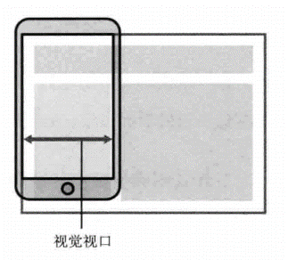
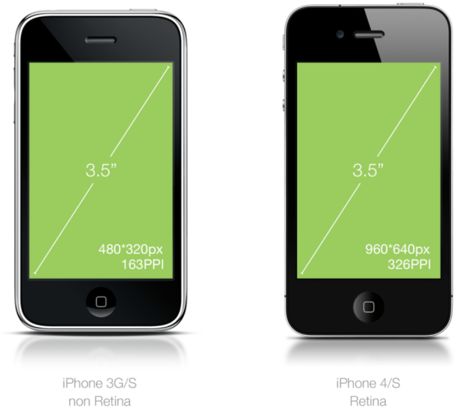
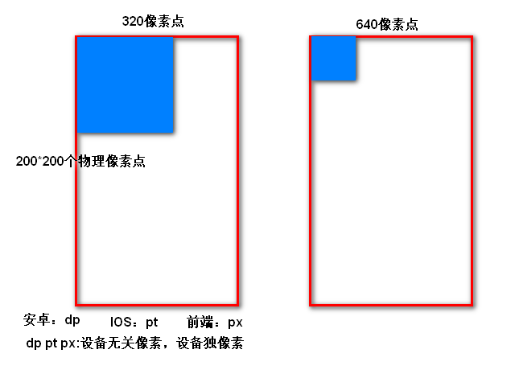
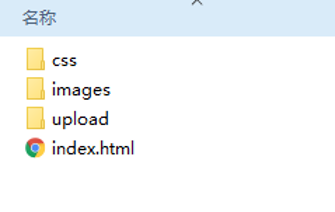
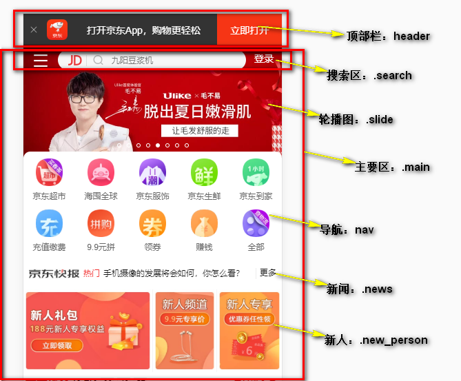

# 流式布局

* 流式布局是比较常用传统的布局方式，通过对盒子的宽度用百分数的控制；


# 移动端现状

* 了解我们做移动端面对的移动端的内核、屏幕分辨率的问题；

## 内核

* 国产主流手机浏览器，内核 webkit，主要处理CSS兼容目标。

## 分辨率

* 手机分辨率：**碎片化太多**
* Android：480x800, 480x854, 540x960, 720x1280，1080x1920 等
* iPhone：640x960, 640x1136, 750x1334, 1242x2208 等
* 2K：手机分辨率

## 前缀（了解）

- 新特性，对各家浏览器更好的兼容，以便以后出了兼容问题，我们可以从这个方向想；
- -moz-：代表 firefox 浏览器私有属性
- -ms-：代表 ie 浏览器私有属性
- -webkit-：代表 safari、chrome 私有属性
- -o-：代表 Opera 私有属性

```css
-moz-border-radius: 10px; 
-webkit-border-radius: 10px; 
-o-border-radius: 10px; 
border-radius: 10px;
```

- 没有工程化工具，根据业务需要写这些前缀，解决样式的兼容；
- 有工程化工具，注意这些工具包的配置。webpack gulp


# 调试

* 不同的调试在不同的阶段使用；

## 谷歌浏览器

* 是**开发过程中的主要模拟手段；**
* 步骤：
  * 1.鼠标右键 检查 或 F12  控制器界面方向；
  * 2.选择 手机模式
  * 3.选择 手机类型及尺寸；调节适当的显示比例；
  * 4.点右键 查看 页面元素；

## 本地搭建访问

* 搭建本地web服务器，手机和服务器一个局域网内，通过手机访问我们自己搭服务器；
* 该测试阶段可在开发过程或者完成开发，本地局域网的**真机调试**；目的就是为了测试页面在真机内的效果；

## 外网访问

* 使用外网服务器，直接IP或域名访问；
* 一般用于即将上线的模拟，测试真实环境的页面的展示效果；


# viewport

* 视口：PC端的页面直接放入手机屏显示，不友好。内容原因没有设置viewport；

## 定义

* 视口：浏览器（PC、移动端）显示页面内容的屏幕区域；不同的屏幕的大小，我们看到的区域也是不同的；

* viewport就是为了解决上面问题；

## 设置前

* 手机浏览器浏览PC端页面：
  * 给HTML默认宽度 980px 移动端，页面初始化时百分百显示；但是页面元素是缩小；
  * 手指缩放，可以正常看见元素，但是内容超出；
* 原因：HTML默认为980px不是很合适；


* 那么设置HTML宽度多少为合适呢？我们眼睛能看到的，屏幕的窗口多大，设置多大就合适；



## 语法

* 默认：HTML980px；
* 理想：手机屏幕多大，HTML就设置是多大；
* meta标签设置：

```html
<meta name="viewport" content="width=device-width, user-scalable=no, initial-scale=1.0, maximum-scale=1.0, minimum-scale=1.0">
```

* **width=device-width：改变HTML默认的980px   为   屏幕的宽度；**
* user-scalable: 是否允许用户缩放屏幕  值：no(0不允许)   yes(1允许)；
* initial-scale：初始化缩放比例；1.0：不缩放；
* maximum-scale：用户对页面的最大缩放比例；值：比例
* minimum-scale：用户对页面的最小缩放比例；值：比例


# 二倍图

* PC端，引入图片，图片的大小就是图片设置的CSS大小。移动端不同，为什么不同？及如何使用？

## 屏幕尺寸（了解）

* 通常我们所指的屏幕`尺寸`，实际上指的是屏幕对角线的长度（一般用英寸来度量）如下图所示
* 1英寸 = 2.54cm **绝对单位**；（到哪都不会变的值）


## 物理像素点

* 早期的屏幕，物理像素点都比较大，比如玩游戏的超级玛丽的画面的颗粒感很强：随着技术的进步，物理像素点会被做的越来越小；会被做小；
* 指计算机显示设备中的最小单位，即一个像素点的大小。每一个像素点可以理解为就是**屏幕上的一个发光点**。每个点可以发一个颜色，就是我们看到的画面。


- **大白话：一个萝卜一个坑：**
  - 萝卜：光、颜色；
  - 坑：物理像素点

## 屏幕分辨率

* 屏幕分辨率：物理像素点的个数来衡量，表示屏幕水平和垂直方向的物理像素点的个数，”坑“有多少个；

* iPhone3和iPhone4是同一个屏幕尺寸下，比较分辨率：




* 坑会越做越小：直观感受，画面细腻；Retina（视网膜屏幕）是一种显示技术，可以将把更多的物理像素点压缩至一块屏幕里；从而达到更高的分辨率，并提高屏幕显示的细腻程度。
* ‘坑’特点：越做越小；（iPhone4坑的宽度是iPhone3坑的宽度一半）


## 图片分辨率

* 图片都是有颜色，图片分辨率。图片分辨率就是带着“萝卜”来的；

- 下图：分辨率640*426 ，提供了多少个色彩发光点（迎合物理像素点）；


* 到这，谁提供萝卜（图片），谁会提供坑（手机上物理像素点）；

* 假设：**有200*200分辨率**的图片，展示在宽度分别是320（iphone3）、640(iphone4)分辨率的手机上，展示的效果如下：

  

* 分析：
  * 200*200分辨率的图片：200个颜色发光点（萝卜）；
  * 一个物理像素点发一个颜色：一个萝卜一个坑，屏幕都需要200个物理像素点；
  * 坑的宽度大小：320（1）；640（0.5）；
  * 所以显示为上图。

* 问题：不同的屏幕下，显示的图片大小是不一样；
  * 宽度：第2个是第1个的0.5倍；
  * 面积：第2个是第1个的1/4倍；

* 目标：显示一样；


## CSS像素 px

* 解决：
  * 坑的宽度大小：i3（1）；i4（0.5）；
  * 坑的数量：320（1 x 200=200长度）、640(0.5 x 400=200长度）；都是200长度，才能保证显示的大小一样；

* 移动端：
  * 上面这个都是200长度到底如何设置呢？
  * 设置CSS 宽高200px后，会自动保证每个屏幕显示元素大小一样，
  * **会自动算出不同屏幕下，背后需要提供物理像素点需要多少个。**
  * 针对上面，每个手机会自动算出要给图片准备200个物理像素点、400个物理像素点；

## 二倍图由来

* 开始：设置CSS像素200px宽，320分辨率（200坑）,640分辨率（400坑）；这样才显示一样；
* 像针对640分辨率手机屏（iPhone4），要求设计给400*400图，对应我们CSS设置200px,有二倍的关系；
* **命名：**
  - xxxxx@2x.png：二倍图
  - xxxxx@3x.png：三倍图

## 小结

* 物理像素点：坑；
* 图片的颜色：萝卜；
* CSS px：设置的CSS px 后，在每个屏幕下，都是显示的大小是一样大的，实质背后就会算出不同的坑；


* 相对于手机端，使用2倍图更为合理；
* **命名：**
  * xxxxx@2x.png：二倍图
  * xxxxx@3x.png：三倍图
* 虽然有二倍图这个概念，只是要求UI给我们二倍图，我们该怎么设置CSS还是怎么设置；


# background-size

* 用图片做背景大小，不能设置图片大小，现在学习完二倍图，不设置CSS大小的话，图片按照原来的图片分辨率显示。

## 语法

```css
div {
    width: 500px;
    height: 500px;
    border: 2px solid red;
    background: url(images/dog.jpg) no-repeat;
    /* background-size: 图片的宽度 图片的高度; */
    /* background-size: 500px 200px; */

    /* 1.只写一个参数 肯定是宽度 高度省略了  会等比例缩放 */
    /* background-size: 500px; */

    /* 2. 里面的单位可以跟%  相对于父盒子来说的 */
    /* background-size: 50%; */
    
    /* 3. cover 等比例拉伸 要完全覆盖div盒子  可能有部分背景图片显示不全
    关键词：等比缩放，绝对没有留白；
     */
    /* background-size: cover; */
    
    /* 4. contain 高度和宽度等比例拉伸 当宽度 或者高度 铺满div盒子就不再进行拉伸了 可能有部分空白区域 
    关键词：等比缩放，显示全面，可能留白 */
    background-size: contain;
}
```

## 使用

* 单个图：设计给我们二倍图，我们该怎么设置CSS还是怎么设置；
* 精灵图的使用：**想要测量出符合设计的要求的页面元素大小；**
  * 在FW内：先等比所小图的一半，在缩小的的图内进行图标位置测量；
  * 在代码：引入图，按照刚才的测量，写入图标的坐标；
  * 设置 背景图片大小：按照缩小一半后的宽高 进行 设置的；
  * 千万不要保存图片，否则就会改变二倍图的分辨率；


# CSS3 盒子模型

- 语法

```css
/* 传统：盒子的总宽度 = CSS中设置的 width + border + padding */
box-sizing: content-box;

/* CSS3盒子模型:盒子的宽度：就是设置的宽度，且宽度width 里面包含了 border 和 padding */
box-sizing: border-box;
```

* 使用场景：侧边栏固定，中间盒子随意拉伸；


# 常见布局

* 了解常见布局不同，针对业务需求选择不同的方案；实际开发过程中，都是混合使用，没有哪一种是绝对的单独使用；

## 内容

* 方案
* 样式初始化

## 方案

* 单独制作：淘宝、京东、苏宁手机端都是单独制作的，流式、flex、rem布局、专门针对各种手机屏幕进行开发。
* 响应式：三星电子官网。www.samsung.com/cn/ ；特点：可兼容PC 移动端，一个页面多个端适配显示；制作起来要考虑到兼容性的样式。
* 选择：公司业务需求；

## 样式初始化-了解

* 国产移动浏览器基本以 webkit 内核为主，因此我们就考虑webkit兼容性问题。
* normalize.css：大家以前自己写的base.css
  * http://necolas.github.io/normalize.css/
  * 保护了有价值的默认值；
  * 修复了浏览器的bug；


# 流式布局

* 百分比布局，使用场景比较传统，**通过百分比控制盒子的宽度；**

## 语法

```css
.p {
    width:100%;
}
.p>div {
    float:left;
    width:50%;
    box-sizing:border-box;
}
```


# 京东案例

* 目标掌握视口标签设置、二部图使用（图片、精灵图）、流式布局的特点；

## 准备工作

* 搭建文件结构：



* 设置视口标签、初始化样式：

```html
<meta name="viewport" content="width=device-width, user-scalable=no,initial-scale=1.0, maximum-scale=1.0, minimum-scale=1.0">

<link rel="stylesheet" href="css/normalize.css">
<link rel="stylesheet" href="css/index.css">
```

* body样式的初始化设置：

```css
body {
  width: 100%;
  min-width: 320px;
  max-width: 640px;
  margin: 0 auto;
  font-size: 14px;
  color: #666;
}
```


## 整体布局

* 设置body
* 布局划分



## dpg 、 webp

- dpg：京东自主研发推出DPG图片压缩技术，经测试该技术，可直接节省用户近50%的浏览流量，极大的提升了用户的网页打开速度。全部浏览器的兼容支持，压缩后的图片和webp的清晰度对比没有差距。
- webp：谷歌开发的一种旨在加快图片加载速度的图片格式。图片压缩体积大约只有JPEG的2/3，并能节省大量的服务器宽带资源和数据空间；

## 其他

1. 先看这个盒子要不要设置高度；没有高度的时候，一般是靠内部子元素撑起来的。
2. 伪元素：左侧或右侧的线、简单的图标采用伪元素进行设置；
3. 结构伪类选择：n 作为参数，一定要放在前面
4. 清除浮动：

```css
/* 必须指定宽度*/
div {
   width: 100%;
   overflow: hidden;
}
```


