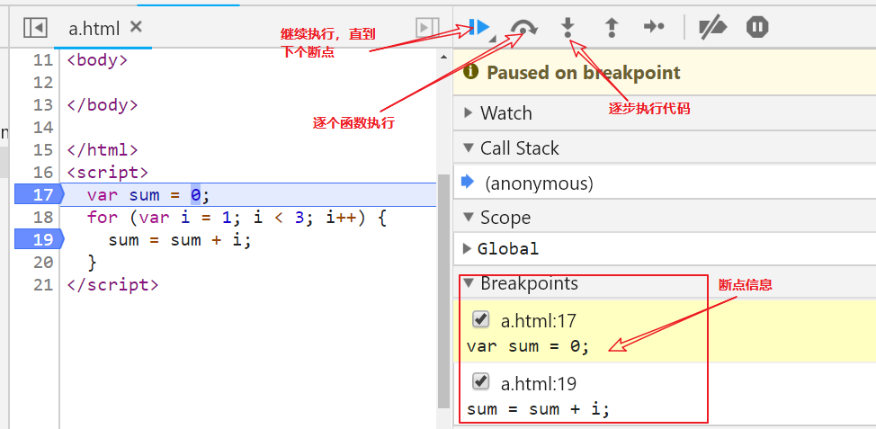

# js基础 day_02

# 流程控制

* 流程控制：我们想要实现一个复杂的效果，只简单的代码是肯定不行的，还要实现代码执行过程的控制；
* 生活：这种情况下，要做这件事；那种情况下，要做那件事；
* 程序：来源生活，高于生活；

## 表达式

* 在js代码中，只要可以返回一个**结果**的，都可以称为一个表达式；

```js
// 下面都可以称为表达式
a++; //   a = a+1 ,
5 > 6; // 结果是 false
1+1；
```

* **技巧：在浏览器后台可以直接敲表达式，回车返回的就是该表达式的结果；**
* 我们昨天学习的各种数据类型的转化，各种数据参与的运算符，最后都会返回一个结果，都可以称为一个表达式；

## 语句

* 语句：可以理解为一个**行为**，一般在行为和行为之间，都会使用 `;` 隔开。
* 行为：告诉浏览器，我要干什么，你按照我写的思路，给我实现出来给用户看；
* 可以理解为：**语句，是有思维参与在里面的表达式，升级版的表达式；**
* 语句有时候会有返回值，有时候就没有；更侧重是一个**行为上**的理解；

```js
// 行为：输出了一个12+12这个表达式的结构 在控制台
console.log(12+12); 

// 行为：弹出了个提示框
alert('helloworld');　
```

* 简而言之：一个`程序`可以由多个`语句`组成，一个`语句`可以由多个`表达式`组成；
* **技巧：**和上面一样，也可以在浏览器控制台打印语句；默认也会把语句的返回值显示出来；


## 结构

* 写程序，就是写各种**语句的组织**，归根到底，就是各种表达式参与我们的思维的体现；在写代码的结构表现上分为下面三种：
  * 顺序结构：从上到下执行的代码就是顺序结构，**程序默认就是由上到下顺序执行的**；
  * 分支结构：不同的情况下，走不同的分支；
  * 循环结构：重复做一件事情，其作用就是用来重复执行代码的；
* **程序的世界中大量的逻辑就是 分支和循环；**


# 分支结构

* 作用：不同的条件，采取不同的行为；

## if结构

* **if结构**：单个if结构，解决的一个分支的判断问题；

```js
// if语句：我想看条件表达式的结果成立时，会怎么样；
// 条件表达式：需要返回Boolean值；如果返回的不是Boolean值，就隐式转化为Boolean值；
if(true) {
   // 当 条件表达式 的结果是 true 时 执行的代码
}

// 例如：判断一下一个人的性别是不是男的
var gender = prompt('请输入性别');
if(gender === '男'){
	console.log('这是一个男人');   
}
// 当输入的结果是 '男' 的时候，就会在控制台中输出消息，否则没有消息输出
```

* **if-else**：解决两个分支的判断问题

```js
if(条件表达式){
   //当条件表达式的结果是 true 时执行的代码
}else {
  //当条件表达式的结果是 false 时执行的代码
}


//例如： 判断一下一个人的性别是不是男的,如果是男的，让他去男厕所，否则去女厕所
// 当输入的结果是 '男' ,输出 男厕所，否则输出 女厕所

var gender = prompt('请输入性别');
if(gender === '男'){
  console.log('请去男厕所');   
}
else {
  console.log('请去女厕所');
}
```

* **if-else-if**：解决多分支的判断问题

```js
// 当满足这个
if(条件表达式1){
   //当条件表达式1的结果是 true 时执行的代码
}
else if(条件表达式2){
  //当条件表达式2的结果是 true 时执行的代码
}
else if(条件表达式3){
  //当条件表达式3的结果是 true 时执行的代码
}
// 中间可以继续写多个判断 ...
else {
  // 多个条件表达式的结果都是 false 的时候执行的代码
}


//例如: 判断一下一个人的性别是不是男的,如果是男的，让他去男厕所，如果是女的，让他去女厕所，否则不让他上厕所
var gender = prompt('请输入性别');
if(gender === '男'){
	console.log('请去男厕所');   
}else if(gender === '女') {
  console.log('请去女厕所');   
}else {
  console.log('你个不男不女的家伙，我们这里没有你能上的厕所，去别处吧');
}
```

* 案例：求两个数的最大值；

```js
var num1 = prompt('请输入第一个数字');
var num2 = prompt('请输入第二个数字');

num1 = parseFloat(num1);
num2 = parseFloat(num2);

if(num1 < num2){
    console.log('第一个数字比较大，他是：' + num1);
}
else if ( num1 === num2 ){
    console.log('两个数字一样大');
}
else {
    // 如果以上两个条件都不成立，就必然是num1 < num2了
    console.log('第二个数字比较大，他是：' + num2);
}
```

* **看代码执行到哪？学会用调试；也可以用console.log();**


## switch-case结构

* switch-case结构：主要用于多个**固定值**之间的判断，只能做固定值的判断

```js
switch （数据）{
  case 固定值1: 
    // 当 数据 === 固定值1 时执行的代码; 先看类型，看值；
    
    // 表示当前 情况结束；
    break;
        
  case 固定值2: 
    // 当数据 === 固定值2时执行的代码;
    // break;
        
  case 固定值3: 
    // 当数据 === 固定值3时执行的代码;
    break;
  // 中间还可以写多个判断
  
  
  default : 
    // 当数据和上面的所有固定值都不相等的时候执行的代码
    break;
}

```

* 非常规：这个结构里面的break并不是必须的，如果两个 case 之间没有break ，执行完了一个break 之后，会继续执行下面的case的代码；但是一般情况都是带着break的；
* 案例：输入星期几，看要做什么事情；

```js
switch (xq) {
    case '星期一':
        alert('今天上课');
        break;
    case '星期二':
        alert('健身');
        break;
    case '星期三':
        alert('休息');
        break;
    case '星期四':
        alert('吃饭');
        break;
    case '星期五':
        alert('上班');
        break;
    case '星期六':
        alert(123);
    case '星期日':
        alert('睡觉');
        break;
        // 可以加一个default，当我们的输入错误的时候，可以提示用户
    default :
        // 说明输入的不是星期1-星期日，提示用户输入有误
        alert('请输入星期一到星期日之间的星期数，您的输入有误');
        break;
}
```


## 三元表达式

* 表达式：**有值会返回；**

* 语法：if else 的简写；有返回值；

```js
// 表达式1 ? 表达式2 : 表达式3;

// 首先 要知道 表达式 会返回结果；
// 先执行表达式1，判断其结果是true还是false，
// 如果是true，则执行表达式2，然后将 表达式2的执行结果 作为整个三元表达式的结果，
// 如果是false，则执行表达式3，并将 表达式3的结果 作为整个三元表达式的结果

//例如： 求二个数字中谁更大
var a = 10; var b = 20;
var max = a > b ? a : b;
console.log(max);
```

## 小结

* if else 多用于判断一个区间、不固定值的判断
* switch-case：多用于固定值的判断；


# 循环结构

* 作用：**只要有重复的思想在里面，就要用到循环；**
* **程序的世界中大量的逻辑就是 分支和循环；**
* 阿里百秀，新闻列表为循环；

## while 循环

* 语法：

```javascript
// 条件表达式结果返回布尔值；true;
while (条件表达式){
  // 循环体  就是重复执行的代码
}
```

* 特点：

  * 设置为true，容易卡死；
  * 设置false，直接就不执行；
* 直接写true false直接就玩死：

```js
// 初始化变量
var num = 1;

// 退出条件：
while(num<=10) {
    // 循环体：过程，你想要重复的事情；这样里面就循环了十次
    console.log(num);
    
    // 满足退出条件的代码
    num++;
}
// 写这种可以配合着循环变化的表达式（先成立，最后不成立）
```


* 案例：

  * 循环求和：一个一个的加：循环！

  ```js
  // 定义一个变量，从1开始
  var num = 1;
  
  // 定义一个总和，一开始是0，没有加任何数之前，都是0；
  var sum = 0;
  
  
  // 使用循环让num不断的自增
  while (num <= 100){
    sum = sum + num;
    num++;
  }
  ```
  * 执行过程：
    - 1.**先执行条件表达式，得到一个布尔类型的结果**
    - 2.如果表达式的结果为false，循环结束，不执行循环后面的代码
    - 3.如果表达式的结果为true，执行循环体；
    - 4.重复1~3的过程，直到表达式结果为false，结束循环；
  * 找偶数：
    * 1-10的数据一个个的过；
    * 每个数据要经过 偶数条件 的筛查；

  ```js
  var num = 1;
  while (num <= 10){
      
    // 把每个数字，进行判断
    if(num % 2 === 0){
      console.log(num + '是偶数');
    }
      
    num++;
  }
  ```


## for循环！！！

### 语法

```javascript
for(初始化表达式; 条件表达式; 自增表达式){
  // 循环体
}
```

* 执行过程：

1. **执行初始化表达式(只执行一次)**
2. **执行条件表达式**
3. 如果条件表达式的结果为false, 结束循环；
4. 如果条件表达式的结果为true，执行循环体
5. **执行自增表达式**
6. 重复2~5的步骤，直到条件表达式的结果为false，结束循环

```javascript
// 例如： 求1-3的和
var sum = 0;
for(var i = 1; i < 3; i++){
  sum = sum + i;
}
```

### 案例：求1-10之间所有偶数的和

* 分析：
  * 1-10每个数都要过一下
  * 找所有满足条件的偶数
  * 加起来；

```js
// 定义一个总和
var sum = 0;
// 先求出1-10之间的偶数
for(var i =1; i <= 10; i++){
  // console.log(i);
  // 判断i是否是2的倍数
  if(i % 2 === 0){
    console.log(i + '是偶数');
    // 把偶数相加
    // sum = sum + i;
    sum += i;
  }
}
```

### 案例：打印正方形

* 分析：
  * 行和列的点阵；
  * 每行，是个循环；
  * 每行的每个点，是个循环；

```js
for (var i = 1; i <= 6; i++) {
    for (var j = 1; j <= 8; j++) {
        document.write('○');
    }
    document.write('<br>');
}
```

* 作业：打印1-100之间所有的质数；

* 质数。指整数在一个大于1的自然数中，除了1和此整数自身外，没法被其他自然数整除的数。


## do-while循环(补充)

* 语法

```javascript
do {
  //循环体
}while(条件表达式)
```

* 执行过程：
  * 先执行循环体
  * 执行条件表达式
  * 如果条件表达式结果为false，结束循环
  * 如果条件表达式结果为true，执行循环体
  * 重复2~4的步骤，直到条件表达式结果为false，结束循环

* 特点：
  * 至少会执行一次；
  * 写true也会卡死；

## 小结

* while、do-while 循环不易看出循环的次数，一般用于**未知次数的循环**
* for循环明显看出循环的次数，一般用于已知次数的循环；**使用最多是for；**
* while、for循环可能一次循环都不会执行
* do-while 循环至少执行一次；


## break和continue

* 循环退出：
  * 满足条件退出
  * 关键字退出：某些情况下，我们不一定要循环从头到尾执行，这个时候就要使用break和continue控制循环的次数；

```javascript
// break 
/* 电梯一共有6层，现在我们要上电梯，我们的教室在3楼，电梯只要到3楼就可以了。*/
for(var i = 1; i <= 6 ; i++ ){
    console.log('现在是'+i+'楼');
    if(i == 3){
        console.log('3楼到了，电梯停了，请下电梯。');
        // 程序 执行到 3，执行了四次就结束了；
        break;
    }
}
// 这里案例用的是for循环演示，while 和do-while一样；
```

```javascript
// continue
// 电梯一共有6层，除了3楼没人下去，其他楼层都有人下去(3楼不停，其他楼层都要停)
for(var i = 1; i <= 6; i++){
    if(i == 3){
        // 执行到 3 时。当前次的程序后面的全部跳过；继续执行后面的次数；
        continiue;
    }
    console.log(i+'楼到了，电梯停了，请下电梯。');      
}
```

* 总结：这个地方只是用for做终止
  * break用于结束整个循环

  * continue用于结束整个循环中的一次，**结束当前这次循环**；

  * break和continue**后面的代码都不会执行**，执行前面的代码；

    


# 调试

* 对于初学者来说，感受代码的执行过程是非常重要的，浏览器中提供了一个可以观察代码执行过程的工具

* 第一步：F12打开开发者工具，点击Sources选项

* 第二步：在左边找到代码所在文件，双击打开

* 第三步：在中间部分找到自己写的代码，在想要暂停的**数字**地方打上断点

* 第四步：触发代码的执行，现在我们的代码是在浏览器打开的时候执行，所以我们只要刷新页面即可。当代码执行到断点所在行，会暂停

* 第五步：通过点击右边的控制执行按钮，可以让代码按照你的意愿

* 

  


