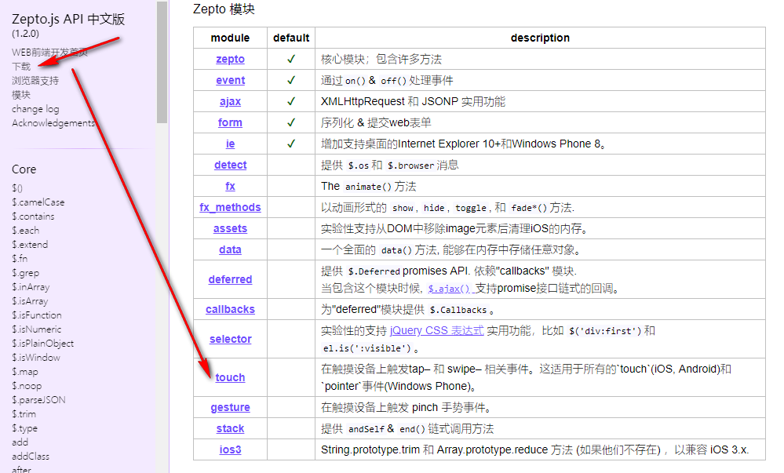
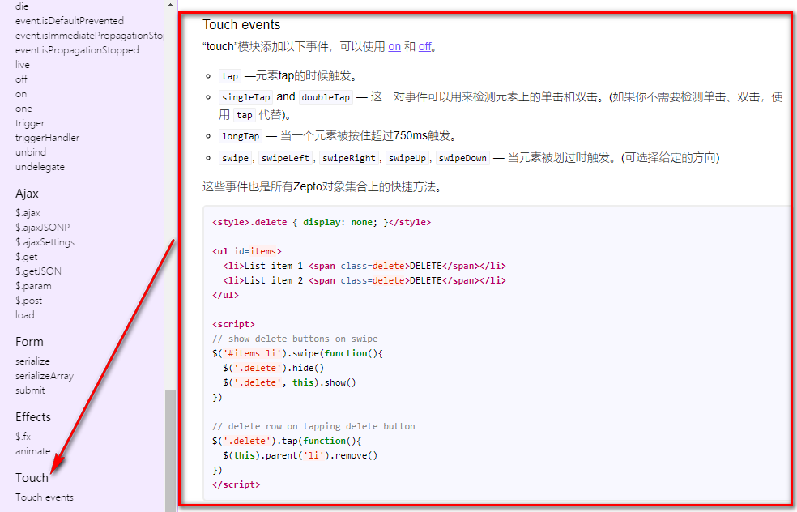
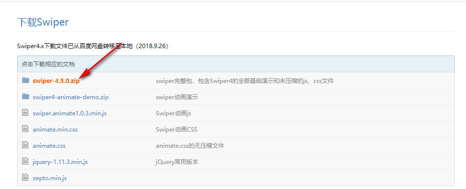
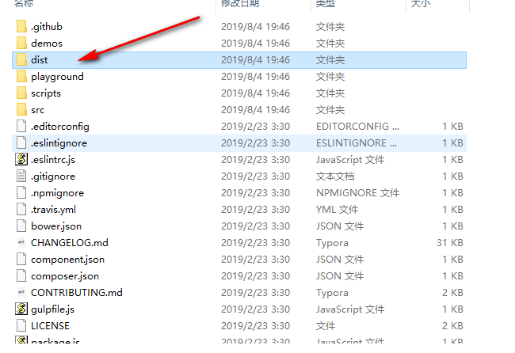
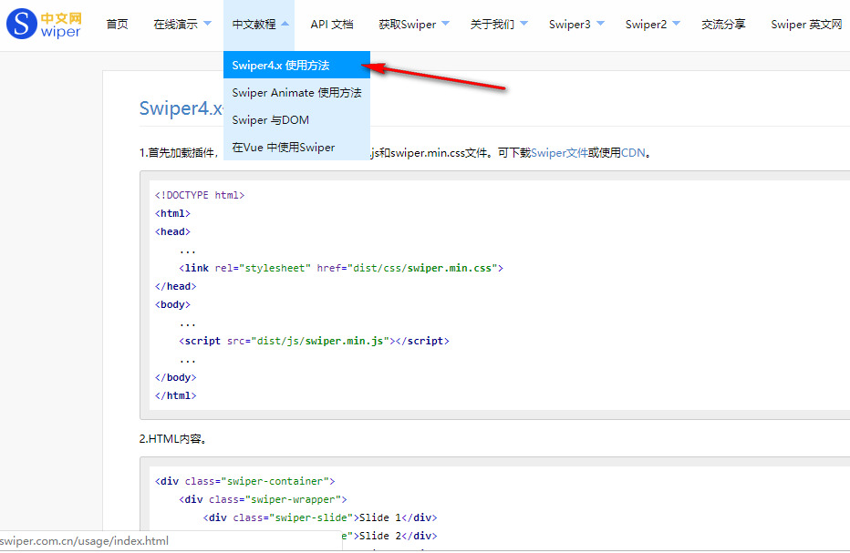

# webApi day_06 


# DOM

## 触摸事件

* **pc端click**：经常使用的一个事件是点击事件，这个事件一般在移动端是不用的；
* **移动端不使用click的原因**：
  * 在移动端可以双击，当我们点一下的时候，移动端不会立刻执行点击事件的，而是会稍微等待一下，
  * 因为移动端会在**点下的瞬间需要知道到底是单击还是双击**，
  * 有一个短暂的延迟才会执行click事件，**但是这个对于用户来说不是太友好。**
* 移动端事件：触摸事件 返回的伪数组

```js
touchstart - 会在手指触摸到屏幕的时候触发
touchmove - 会在手指触摸到屏幕，移动的过程中触发
touchend - 会在手指离开屏幕的瞬间触发
```

* 注意：
  * 触摸事件在pc端是不会触发的，**必须是在移动端才可以**;
  * 推荐使用addEventListener的方式注册：很多移动端的事件，都是后面h5或者c3才出现的，on的方式没有对应的属性

* **事件对象  属性：触摸点**

```js
事件对象.touches - 屏上面的触摸点
事件对象.targetTouches - 元素上面的触摸点
事件对象.changedTouches - 变化的触摸点
```

* 用一个手指触摸屏幕内的元素：
  * **刚触摸时touchstart**：touches、targetTouches、changedTouches，有一个值；都是同一个值；
  * **在元素上触摸移动时touchmove**：touches、targetTouches、changedTouches，有一个值；都是同一个值；
  * 离开屏幕：touches、targetTouches没有值；changedTouches有最后离开屏幕的值；

```js
  box.addEventListener('touchstart', function(e) {
    // console.log(123);
    console.log(e.touches);
    console.log(e.targetTouches);
    console.log(e.changedTouches);

  })

  var key = true;
  box.addEventListener('touchmove', function(e) {
    if (key) {
      key = false;
      console.log(456);
      console.log(e.touches);
      console.log(e.targetTouches);
      console.log(e.changedTouches);
    }
  });

  box.addEventListener('touchend', function(e) {
    console.log(789);
    console.log(e.touches);
    console.log(e.targetTouches);
    console.log(e.changedTouches);
  })
```


## 封装tap手势

* **手势：**单击、双击、三击、放大、旋转、滑动....（相当于PC端的各种事件类型，PC端的事件相对简单）
* 以上这些手势，**都JS没有原生的事件对应的**；
* 比如类似PC的点击click，在移动叫tap事件，我们只能自己利用js里面提供的touch事件自己封装。（封装的难度较大）
* **tap要求：模拟PC端的点击**  
  * 点下和松开的**位置要接近**
  * 点下和松开的**时间不能太长**
* 思路：
  * 在touchstart的时候，**记录开始位置**，在touchend的时候**记录结束位置**，相减，判断这个差不能大于某个值；
  * 在touchstart的时候，**记录开始时间**，在touchend的时候**记录结束时间**，相减，判断这个差不能大于某个值；
* 目标：我们自己要封装一个类似PC的点击，叫tap事件；
* 实现：
  * 获取元素：随便获取个元素对象；
  * 注册事件：touchstart、touchend
  * touch之后：
    * touchstart：
      * 判断点击touches的对象数量，若为2，则不是一个手指在点击；返回false;
      * 若为1个对象：**记录开始位置和开始时间；**
    * touchend：
      * 判断点击changedTouches的对象数量，若为2，则不是一个手指在点击；返回false;
      * 若为1个对象：
        * 记录结束位置和结束时间
        * 把位置和时间相减，再判断是否小于我们规定的值；
        * 从而判断是否为单个手指的“点击”效果；
        * 最后执行回调函数；

```js
// 封装：现阶段，封装对于我们来说，函数比较容易实现
// 函数，就需要参数，所以需要明确函数的参数的作用；
/**
 * 自己封装的tap事件
 * @param {object} element 事件源
 * @param {function} callback 事件处理程序
 * @param {number} offset 手指抖动的最大偏移量,默认是50
 * @param {number} timeSpan 点下的最大毫秒数，默认是300
 */
function tap(element, callback, offset, timeSpan) {
    offset = offset || 50;
    timeSpan = timeSpan || 300;
    var startX, startY, startTime,endTime;

    element.addEventListener('touchstart', function (e) {
      // 判断是否是一个手指按下
      if (e.touches.length != 1) {
        console.log('已经不是一个手指的操作了');
        return;
      }
      // 记录开始位置
      startX = e.touches[0].pageX;
      startY = e.touches[0].pageY;
        
      // 记录开始的时间
      startTime = Date.now();
    })

    element.addEventListener('touchend', function (e) {
      // 判断是否只有一个手指
      if (e.changedTouches.length != 1) {
        console.log('不是单击操作');
        return;
      }
        
      // 记录结束位置
      var endX = e.changedTouches[0].pageX;
      var endY = e.changedTouches[0].pageY;
      // 记录结束时间
      endTime = Date.now();
        
        
      // 计算，判断
      if (endTime - startTime > 300) {
        // 不是单击，是长按
        console.log('时间长按了');
        return;
      }
      
      // 希望开始和结束之间的距离不要超过50 - 要计算一下绝对值，因为我们滑动的方向可能不确定
      if (Math.abs(endX - startX) >= 50 || Math.abs(endY - startY) >= 50) {
        console.log('滑动了太多的位置');
        return;
      }

      // 如果是一个单击tap事件，就应该调用一个函数
      callback && callback();
    })
  }
```

* 自己封装一个是比较麻烦，一般在开发里面，会使用别人**封装好的类库；**


# zepto 类库

## 介绍

* 一个比较流行的，**移动端专用的类库**(尽量不要在pc端使用)；
* **Zepto**是一个轻量级的**针对现代高级浏览器的JavaScript库，** 
  * 它与jquery**有着类似的api**。 如果你会用**jquery**，那么你也会用zepto。
  * jquery：很早的类库，PC端使用的类库，我们下个阶段会学；
* zepto类库能做什么？**封装好的功能，更简单的使用；**
  * **操作DOM节点**：增删
  * **注册事件**
  * 操作属性（标准、自定义）
* 引入：
  * 中文API：https://www.html.cn/doc/zeptojs_api/
  * 下载：选择版本；
  * 使用script:src的形式引入JS文件；


## API

* 中文API：https://www.html.cn/doc/zeptojs_api/

* 获取元素对象

```js

// 返回值 是一个伪数组 称为 zepto对象，
var box = $(选择器);  //大概理解为背后是document.querySelectorAll("")
```

* 注册事件、修改样式

```js
// zepto的事件源.on(事件类型,处理程序);
box.on('click', function() {
    // 修改样式 zepto对象.css(属性名,属性值);
    box.css('backgroundColor', 'red');
});
```

* 操作DOM节点

```js
box.append('<a href="#">百度</a>');
```

* 样式：

```
// 获取宽度
box.width()；
box.css("width","200px")；
```

* 其他如果感兴趣，自己看看文档，可以提前参考**jquery**进行学习；


## 手势 touch.js

* zepto这个类库特点：把**多个功能分割为了多个独立的模块**，每个模块负责不同的功能，当我们需要哪个功能，就引入哪个模块。
* 分模块的原因：以前移动端的网络速度比较慢，希望把每次加载页面所需的资源尽量减少。提高页面的加载速度。
* 手势模块：zepto里面有一个专门负责封装手势的模块，touch.js

* 引入：
  * 找到文档里面的模块部分，点击跳转到模块描述区域，点击touch.js的模块跳转过去，把该页面的js代码自己复制到自己的项目里面
  * 引入，但是必须是在引入了zepto.js之后引入，因为touch.js仅仅是zepto.js的功能的拓展




* API文档：touch模块的使用
  * 可以直接使用on的方式注册
  * 可以使用事件名称作为方法使用



## tap

* 手势：点击

```javascript
// zepto.js提供了下面的方式注册tap事件
// 1 使用on的方式注册
$('.box').on('tap',function(){
  console.log(1);
});

// 2 调用tap方法
$(".box").tap(function(){
  console.log(3);
});
```

## swipe

* 手势：滑动

```js
// 注意：这不是原生的事件，这是类库封装后的方法；
// 封装后：我们只需要关注如何使用，能给我们提供什么就可以了；
$(".box").on('swipeLeft', function() {
    console.log(2);
});
```


### 案例：简单轮播图

* 需求：
  * 左划效果：图片从第n张到第n+1张
  * 右划效果：图片从第n张到第n-1张

* 左划实现：
  * 获取元素：box、ul
  * 注册事件：box注册swipeLeft 
  * 左划之后：
    * 设置全局索引，代表当前的图片的下标及显示的位置；
    * 左划，索引从当前+1，计算出ul应该出现的位移，设置给ul;
    * 同时划到最后一张时，当前下标是图片数组长度-1，再次左划，归于0；

```js
// 这个伪数组我们称为 zepto对象，
var box = $(".box"); 
var ul = $(".box > ul");
// 获取图片的宽度
var imgWidth = box.width();


// 下标：0 显示HTML：第1张
var currentIndex = 0;

// 往左划
box.on('swipeLeft', function() {
    // 让当前索引++
    currentIndex++;

    // 下标0:1；
    // 下标6:第7张；按道理应该显示第1张，下标回归0；
    if (currentIndex == li_arr.length) {
        currentIndex = 0;
    }

    // 计算出ul应该在的位置 = 索引 * 图片宽度 * -1
    var target = currentIndex * imgWidth * -1;
    ul.css('transform', 'translate(' + target + 'px)');
});


// 右划
box.on('swipeRight', function() {
    currentIndex--;
	
    // 下标-1：应该是第六张，就是5；
    if (currentIndex == -1) {
        currentIndex = 5;
    }

    var target = currentIndex * imgWidth * -1;
    ul.css('transform', 'translate(' + target + 'px)');
});
```


### 案例：无缝轮播

* 上个案例：从第6张到第1张的时候，我们想也要一个滑动过渡的效果；

* **解决：我们使用一个小手段，骗下用户的眼睛。给首尾各添加一张图片；**

```html
<ul>
      <li><a href="#"></a></li>
      <li><a href="#"></a></li>
      <li><a href="#"></a></li>
      <li><a href="#"></a></li>
      <li><a href="#"></a></li>
      <li><a href="#"></a></li>
      <li><a href="#"></a></li>
      <li><a href="#"></a></li>
    </ul>
```

* **无缝原理：**
  * 当我们划到6.jpg时（实际上在HTML顺序上是倒数第二张），让用户觉得已经到最后一张了。
  * 再往左划时，会划出来1.jpg（实际上在HTML顺序上是最后一张），让用户觉得到无缝到了第一张了。
  * 这个瞬间，最后一张图片会有个过渡；
* **这个时候，我们通过一个事件（当过渡结束时），我们一瞬间把整个管理图片的父亲的位置归到1.jpg（实际上在HTML顺序上是第二张）的位置；这样就无缝完成！**
  
* 第一步：修改HTML结构上增加了两个子元素，css样式要改变

```css
ul {
  /* 把li变成8张之后，需要，把ul的宽度变宽 */
  width: 800%;
  display: flex;
}
li {
  float: left;
  width: 12.5%;
}
```

* 实现：
  * 获取元素：box，ul等
  * 注册事件：左右划、过渡结束
  * **划动过渡结束后：**

* 第二步：**判断当前的下标在划动过渡结束后进行判断，那么就不需要左划右划里进行判断了**；
* 第三步：默认显示HTML结构第2张，下标初始化为1；

```js
  var currentIndex = 1;

  // 一开始执行下；
  var target = currentIndex * imgWidth * -1;
  ul.css('transform', 'translate(' + target + 'px)');

  // 需要把CSS的过渡效果注释掉；
  // 若一开始加上，会有过渡的效果发生；
  setTimeout(() => {
    ul.css('transition', 'transform 300ms');
  }, 1);
```

* 第三步：**划动过渡结束后的全局的下标的值进行判断**
  * 往左划时：
    * 下标为7时，显示的为HTML结构上的第8张；
    * 在过渡结束后，下标立马回到1；（下标为1，HTML显示为2）
    * 是返回去了，但是过渡效果还在；所以应该先去除过渡效果，在移动，再加上过渡效果；

```javascript
ul.on('transitionend', function() {
    // 往左滑动的时候；
    // 当下标变为7的时候，显示的是HTML结构上的第8张；
    // 滑动的过程中，过渡没有结束
    // 过渡结束后（过渡效果已经完成了），如果为7时，应该立即让你回到HTML结构上的第2张，下标为1；
    if (currentIndex == li_arr.length - 1) {
      // 立马回到HTML结构上的第2张，设置下标1；
      currentIndex = 1;
		
          
      // 回到正确的位置
      var target = currentIndex * imgWidth * -1;
      ul.css('transform', 'translate(' + target + 'px)');
        
      // 但是过渡效果还在啊；去掉过渡
      ul.css('transition', 'transform 0ms');

      // 回到正确的位置后，后面还应该加上过渡
      setTimeout(function() {
        ul.css('transition', 'transform 300ms');
      }, 1);
        
    }


    // 往右滑动
    // 当我们滑到1.jpg,实际上HTML结构顺序是2，下标是1；
    // 当我们滑到6.jpg,实际上HTML结构顺序是1，下标是0；
    // 过渡结束后（过渡效果已经完成了），如果为0时，应该立即让你回到HTML结构上的第7张，下标为6；
    if (currentIndex == 0) {
      currentIndex = li_arr.length - 2;

      // 回到正确的位置
      var target = currentIndex * imgWidth * -1;
      ul.css('transform', 'translate(' + target + 'px)');

      // 但是过渡效果还在啊；去掉过渡
      ul.css('transition', 'transform 0ms');

      // 回到正确的位置后，还应该加上过渡
      setTimeout(function() {
        ul.css('transition', 'transform 300ms');
      }, 1);
    }

  });
```


# swiper 插件

## 介绍

* 插件：部分小功能的实现，比如轮播图；
* 中文官网 ：https://www.swiper.com.cn/
* 以后如果找一个插件，去到人家提供下载和demo的地方，先看看demo，是不是你想要的效果；如果确定了这就是你想要的效果，看**教程开始**学习

## 使用

* 下载





* 引入

```HTML
<link rel="stylesheet" href="./swiper/css/swiper.css">
<script src="./swiper/js/swiper.js"></script>
```

* 教程：按照官方教程一步一步来；根据自己的需求稍微修修改



```html
<!-- swiper插件需要的一个固定结构 -->
  <div class="swiper-container">
    <div class="swiper-wrapper">
      <div class="swiper-slide">
        <a href="#">
          
        </a>
      </div>
      <div class="swiper-slide">
        <a href="#">
          
        </a>
      </div>
      <div class="swiper-slide">
        <a href="#">
          
        </a>
      </div>
      <div class="swiper-slide">
        <a href="#">
          
        </a>
      </div>
    </div>
    <!-- 如果需要分页器 -->
    <div class="swiper-pagination"></div>
    <!-- 如果需要导航按钮 -->
    <div class="swiper-button-prev"></div>
    <div class="swiper-button-next"></div>
  </div>
```

* 根据文档的指示，调用一个方法

```javascript
var swiper = new Swiper('.swiper-container');
```

* 根据文档学习更多的功能：分页器、左右按钮、无缝滚动、自动播放；

```javascript
var swiper = new Swiper('.swiper-container',{
  // 动画持续时间，过渡的持续时间
  speed : 毫秒数,
  
  // 是否形成闭环，无缝滚动；
  loop:true,
    
  // 分页
  pagination : {
    // 分页器的选择器
    el : '.swiper-pagination'
  },
    
  // 左右按钮
  navigation: {
    // 按钮的选择器
    nextEl: '.swiper-button-next',
    prevEl: '.swiper-button-prev',
  },
  
  // 自动轮播
  //autoplay : true,// 按照默认的时间切换 , 默认是3000毫秒
  // 自定义自动轮播的时间
  autopaly : {
    delay : 毫秒
  }
});
```


