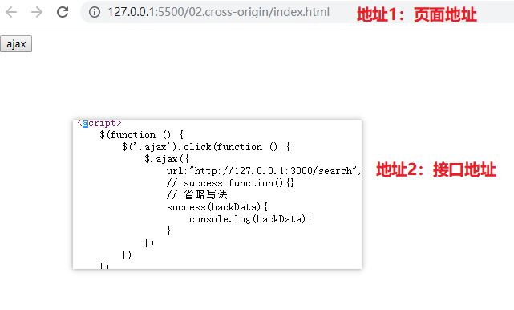
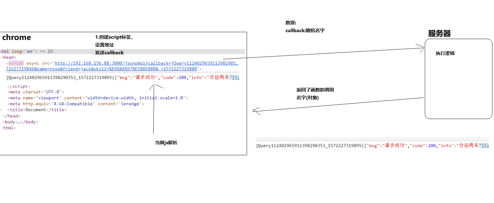
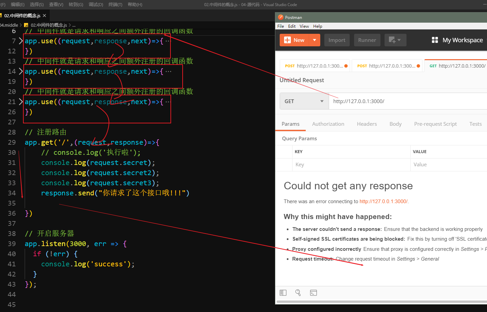
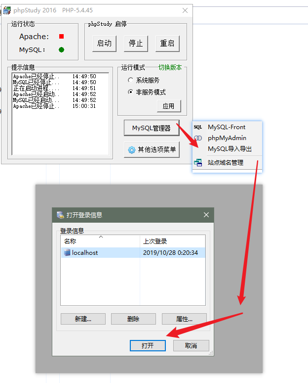
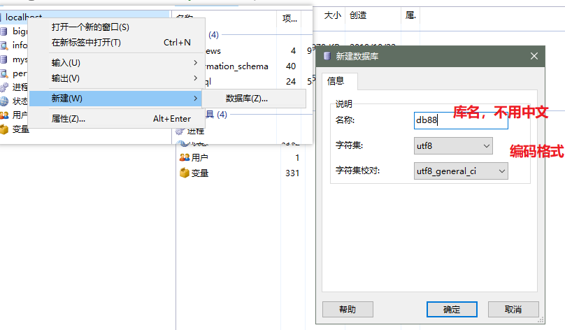
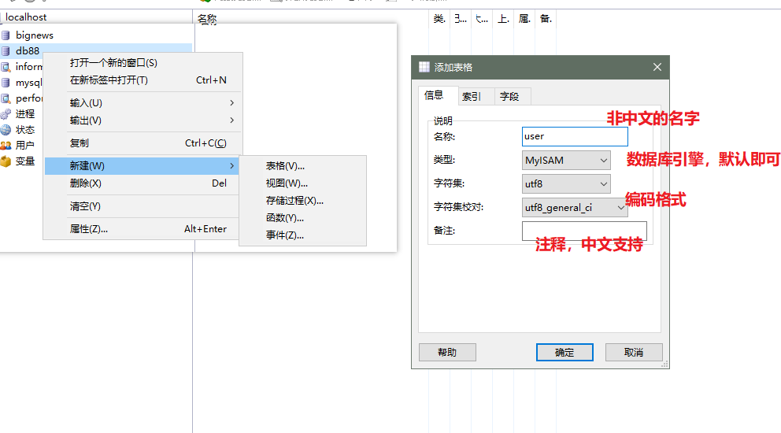
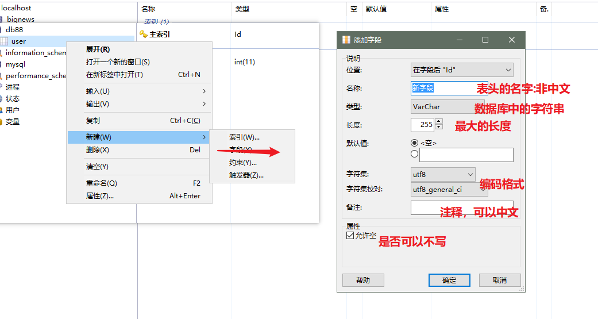
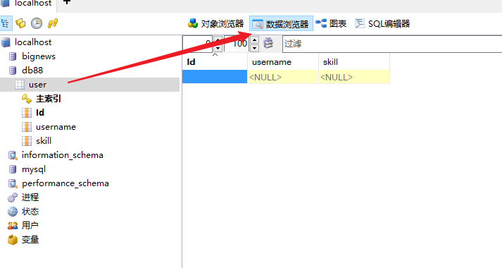
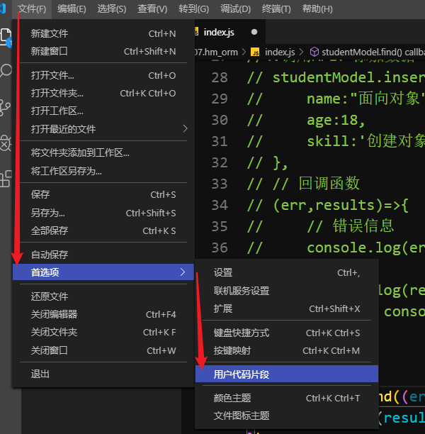
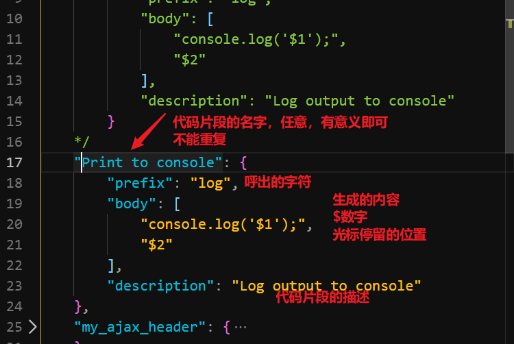

# Node.js - day04

## 回顾

1. express基本使用
   1. `npm init -y`
   2. 下包 `npm i express`
   3. 导包
   4. 用包
   5. 强烈建议 先跑起来，再改
2. express托管静态资源
   1. `app.use(express.static('文件夹'))`
3. express注册路由 - get
4. express注册路由 - post
5. express中间件 - body-parser
   1. 安装
   2. 导包
   3. 使用
6. express中间件 - express-fileupload
   1. 安装
   2. 导包
   3. 使用

## 跨域

> 不是什么接口都可以直接调用成功的哦，比如跨域的接口


1. `Ajax请求`不同源接口的时候会出现
2. `浏览器`为了保护我们帮我们做的限制
3. 浏览器打开的页面，和调用的接口需要`同源`才可以调用

## 浏览器同源

> 协议，地址（域名），端口 任意一个不相同就是跨域呢

传送门: https://developer.mozilla.org/zh-CN/docs/Web/Security/Same-origin_policy 

url地址的组成:` http://127.0.0.1:3000/search `

	1. 协议:`http://`
 	2. 地址(ip):`127.0.0.1`
 	3. 端口:`3000`



同源:

1. 浏览器打开的页面地址:
   1. http://127.0.0.1:5500/02.cross-origin/index.html 
2. 页面同Ajax调用接口的地址:
   1. http://127.0.0.1:3000/search
3. 协议，地址，端口全部相同，称之为`同源`，
   1. 页面地址和接口地址同源，浏览器就不会做任何的限制
   2. 可以自由访问
4. 协议，地址，端口任何一个不相同`不同源`
   1. 浏览器默认是禁止访问的
5. 实际工作中，不可避免页面地址和接口地址绝对同源
   1. 肯定有解决方案
   2. 常用的有两种
      1. `cors`:目前用的最多的
      2. `jsonp`:曾经最多的，现在越来越少，面试喜欢问
6. 往不同源的接口发请求，`跨域`

## 跨域方案 - jsonp

>  JSON with Padding 利用了src属性支持跨域访问实现的跨域请求哦
>
> 虽然是民间方法，但是也成为了一个大伙约定俗成的标准了

1. 民间的解决方案
2. 使用方式:
   1. 前端：
      1. $.ajax
         1. url
         2. type:必须是get
         3. success:function(backData){}
         4. dataType:'jsonp'
   2. 后端:
      1. `response.jsonp({key:value,key2:value2})`

注意：

1. 如果接口是jsonp
2. 前端要干的事
   1. dataType:'jsonp',
   2. type:'get' 或者省略
   3. 数据的发送，请求成功之后的回调函数 和之前完全一样
3. 后端代码，工作中不用我们写
4. jsonp接口文档
   1. 请求地址: `接口地址`
   2. 请求方法：`jsonp`  （type:`get`,dataType:`jsonp`）
   3. 参数：`键值对`


## jsonp原理（面试会碰到）

> 虽然这个方案现在用的越来越少，但是面试还是挺爱问的

1. script标签的src属性，可以发送请求，没有`同源限制`
2. 和`Ajax`一点关系都木有：
   1. `network`中选到`xhr`分类，什么都看不到
3. 本质是动态创建了一个`script`标签添加到页面顶部
   1. src设置的:`接口地址`+`发送的数据`+`callback=xxx`
4. 请求成功之后会被自动移除
5. 服务器返回了:函数的调用`函数名({对象})`
6. 内容返回到浏览器之后会被解析为`js`，调用定义好的函数，传入了一个参数

jQuery的jsonp



自己写jsonp


注意：

1. 工作中肯定是用jQ的
2. 自己写需要
   1. 创建标签
   2. 声明函数
   3. 可能还需要自行移除标签
   4. 这些`jQ`都帮你干好了
3. 虽然是民间的解决方案，但是很好用，广大程序员就做好了约定
4. 你必须发送`callback`
5. 后端也是通过`callback`去获取方法名字
6. 缺点:
   1. 不支持`post`请求
   2. 数据大的话，搞不定，文件上传搞不定
7. 流行的原因:
   1. `兼容性`好到令人发指

## 跨域方案 - CORS(目前最为流行的方案)

> 需要后端配合
>
> 目前最为常用的一种跨域解决方案

传送门: https://developer.mozilla.org/en-US/docs/Web/HTTP/CORS 

1. CORS:
   1. cross:跨
   2. origin：域
   3. resource：资源
   4. sharing：共享
2. 目前用的最多的
3. `HTML5`中推出的新标准，低版本浏览器不支持`ie`

用起来简单到令人发指：

1. 前端：什么事不不用干
2. 后端：设置允许跨域
   1. express中：
      1. 响应数据之前：设置一个允许的header
      2. ` response.header('Access-Control-Allow-Origin', '*');`
   2. 无论用什么开发的后端：都需要设置上面类似的内容，才可以允许前端访问


注意：

1. CORS原理：
   1. 浏览器能够识别` ('Access-Control-Allow-Origin', '*');`这个header
   2. 请求发给服务器之后
   3. 服务器返回的响应头中有一个允许的标记
   4. 浏览器就认为服务器允许跨域访问，没有了跨域的错误
2. 缺点：
   1. 兼容性比`jsonp`差一些
   2. 微软已经放弃`xp` `ie5,ie6`基本没人用
3. 优点:
   1. get和post都支持
   2. 前端什么都不用干
4. 无论是jsonp还是`cors`一定需要后端配合
5. 纯前端在`正常情况下无法跨域`

## express - 中间件 设置跨域

> 通过注册一个所有请求都会执行的公共回调函数来统一设置跨域

请求和响应之间额外注册的一个`回调函数` 

1. 在这个回调函数中统一的设置允许跨域的那个头

```javascript
// 自己写 中间件 来运行跨域
app.use((request,response,next)=>{
  console.log('执行啦');
  // 设置运行跨域
  response.header('Access-Control-Allow-Origin', '*');
  // 调用next
  next();
})
```


## express - 中间件

> 刚刚额外注册的那个回调函数就是中间件哦

传送门: http://www.expressjs.com.cn/guide/writing-middleware.html 

```javascript
app.use('地址(可选)',function(request,response,next){
    // request 后续的函数共享这个request对象
    // response 后续的函数共享这个response对象
    // 执行下一个函数
    next();
})
```

1. 中间件是请求和响应之间额外注册的回调函数
2. `request`和`response`是共享的
3. 中间件中为`request`对象额外增加的属性
4. 在后续的回调函数中可以获取到
5. 中间件可以增加`任意个`
6. `next`如果不调用，卡住，浏览器接收不到数据
7. 在请求和响应之间，额外注册的回调函数
8. `请求`--`回调函数（中间件）1`---`回调函数（中间件）2`------->`响应`
9. 执行的顺序从上到下依次执行
10. 编写的位置路由的前面
11. 从上往下依次执行
12. 

注意:

1. 中间件是回调函数
2. 请求和响应之间额外注册的回调函数
3. 请求和响应之间根据注册的顺序依次执行
4. `next`调用了才会继续执行
5. `请求(request)`和`响应(response)`对象`共享`

## node.js 模块化

> node.js中模块的抽取必须要遵守特殊的语法哦

传送门-`CommonJs`标准：<http://www.commonjs.org/>

* 1.世界上的编程规范有很多种，CommonJS只是其中一种
* 2.CommonJS规范不是只为Nodejs服务，有很多平台都遵循CommonJS规范，Nodejs平台只是其中之一
* 3.CommonJS规范只有三句话
  * 1.导入模块使用:`require()`
  * 2.导出模块使用:`module.exports`
  * 3.导出模块一定要使用:`module.exports`(重要是事说两遍)


注意：

1. 导入模块`require`
   1. 自己的模块写路径
   2. `.js`可以省略

2. 模块暴露`module.exports`
   1. 类似自调用函数底部`window.xxx=值`
   2. 暴露多个，用对象方式
   3. 重复为`module.exports`赋值后面的会把前面的覆盖
3. 抽取的模块不需要运行
4. 导入的时候内部的代码会自动解析
5. `module`是关键字，全局变量
6. 要用哪个属性，就点哪个属性

## 自己写计算器模块

注意

1. 写功能
2. 暴露出去`module.exports={add,sub,mul,divi}`
3. 导入模块:`computer`
4. 使用方法:`computer.add(10,7)`

## 跨域模块抽取

> 刚刚的中间件抽取为一个独立的模块，哪里都可以用哦

步骤:

1. 创建了一个文件夹`utils`

   1. 工作中`自己抽取`的功能模块，很多公司都会放在这个文件夹中
2. 创建一个文件
   1. 暴露回调函数
3. 任意一个文件 导入`模块`
4. `app.use(模块)`

自己写的模块

```javascript
// 暴露
module.exports = 
(request, response, next) => {
  console.log('执行啦');
  // 设置运行跨域
  response.header('Access-Control-Allow-Origin', '*');
  // 调用next
  next();
};

```

使用模块

```javascript
// 导包
const express = require('express');
// 导包 自己抽取的模块 跨域
const myCORS = require('./utils/myCORS');
// 创建服务器
const app = express();

// 自己写 中间件 来运行跨域
app.use(myCORS)

// 注册路由 - get
app.get('/corsGET', (request, response) => {

  response.send('/get');
});

// 注册路由 - post
app.post('/corsPOST', (request, response) => {

  response.send('/post');
});

// 开启服务器
app.listen(3000, err => {
  if (!err) {
    console.log('success');
  }
});


```

常见文件夹名:

 1. utils：自己抽取的功能模块

 2. libs:下载的第三方模块（自己手动下载）

 3. node_modules:`npm i 模块名`自动下载的文件夹，内部保存了第三方模块

 4. `static`：静态资源`html,css,js`

 5. public:公共文件（静态资源）

 6. `web`：页面(静态)

    

## 什么是数据库

> 通俗的来说就是数据的仓库，软件来的，保存数据同时，数据的安全性也得以保证

1. 数据库分类:

   1. 关系型数据库：
      1. 类似于`table`表格的形式保存数据
      2. 使用`sql`的语句操纵数据
      3. 常见的有:`MYSql`,`Oracle`,`MSSql`。。。
   2. 非关系型数据库:
      1. 用类似于`js对象`的形式保存数据
      2. 使用操纵对象的形式操纵数据
      3. 常见的有:`Mongodb`,`Redis`。。。
2. 数据库管理员:
   1. DBA:DataBase Admin
3. 数据库服务器:
   1. 只提供数据库服务，其他的都木有

## MySql基本使用

> 建库，建表，增加字段，增删改查

1. MYSql
   1. 免费，
   2. 开源，可以看到源代码，可以修改，可以定制
   3. 轻量级：小
   4. 作为关系型数据库的市场份额比较大
2. 建库（银行开户，有了一个存数据的空间）
3. 建表（一个一个的架子，excel）
4. 建字段（excel的表头）


1. 打开mysql



1. 建库:
2. 
3. 建表
4. 
5. 建表头
6. 
7. 查看数据
8. 

## sql语句 - 增（insert）-了解即可

> 数据的新增，也可以叫做数据的插入

```sql
insert into 表名 （字段1，字段2，字段3...） values(值1，值2，值3...)
```

```sql
insert into user (username,skill) values('蔡*坤','唱，跳，rap');
```

## sql语句 - 删（delete）

> 数据的删除，但是正式工作中用的不多，数据可是很珍贵的哦

```sql
delete from 表名 where 条件
delete from user where id=3; 删除一条
delete from user where id <3; 删除范围
delete from user;不跟条件全部被干掉
```

1. 必须给条件，否则全部删除

## sql语句 - 改（update）

> 数据的修改，记得跟上条件

```sql
update 表名 set 字段1=值1, 字段2=值2,..... 条件
update user set username='赵四' ,skill='尬舞' where id = 22;
update user set username='葫芦娃' ,skill='救爷爷' where id > 22;
update user set username='小蝴蝶' ,skill='坑葫芦娃';
```

1. 条件不给全部改变

## sql语句 - 查（select）

> 数据的查询，通过各种条件进行数据的检索

```sql
select * from 表名 条件;
select * from user where id =26; 精确查询
select * from user where id <26;范围
select * from user ;全部
```

1. 和增删改不同，获取到数据本身
2. 增删改只能看到`几条数据`被改变了
3. 数据的基本操作分为4中，增删改    查

## mysql模块使用（了解）

> 通过node.js操纵数据库的第三方模块，了解即可

传送门:  https://www.npmjs.com/package/mysql 

1. 在Node.js中通过`MySQL`模块操纵数据库（间接操纵）数据库
2. 本质还是`sql`比较麻烦

## mysql-ithm模块使用（推荐）

> 黑马程序员开发，轻量级的`orm`( Object Relational Mapping )框架,记得好评哦

通过调用方法的方式，去间接的操纵数据

理论上来说一行`sql`都不需要写

只要会调用方法，你就可以操纵数据

用操纵对象的方式去操纵数据库

底层还是`sql`只不过不用开发人员自己写了

开发的速度更快

也是工作中绝大多数后端使用的开发方式

## 假数据生成 mock.js（明天讲）

> 批量假数据生成

## 补充 - app中没有跨域

1. 绝大多数的`app`也需要和服务器交互
2. 使用的技术不是`ajax`,但是类似
   1. 地址
   2. 参数
   3. 回调函数
3. 因为不是`ajax`没有跨域
4. 一个项目的后端接口可能只有一套
   1. 早期给`app`用
   2. 公司由于业务增加，需要做网页版本
   3. 数据接口之前`app`可以正常使用
   4. 前端调用接口用`ajax`
   5. 不同源就跨域了会报错
5. 有可能后端不知道需要设置跨域
   1. 友善的提示一下
   2. 设置即可

## 补充 - VSCode代码片段

1. 用几个单词，写出一堆代码
2. 
3. 
4. `prfix`建议加上一个自己独有的前缀，方便记忆

## 补充 - 截图神器

传送门: https://www.snipaste.com/ 

1. 取色:f1截图的时候，按c取色，按`shift`切换颜色格式
2. 改粗细:滚轮，1,2
3. 还原截图:f3
4. 订图：开始普及

## 拓展阅读 - chrome允许跨域（了解）

* 跨域是浏览器的一个安全限制

* 可以通过修改一些设置，让被设置的浏览器没有这个同源的限制

* 修改之后
  * 1.浏览器明确告诉你 不安全 （不安全，一般没人设置）
  * 2.只有设置的浏览器可以跨域（会主动设置这个应该是`程序员`吧）
* 仅作课后了解即可：https://www.cnblogs.com/laden666666/p/5544572.html


