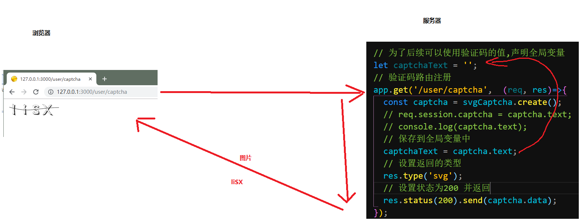
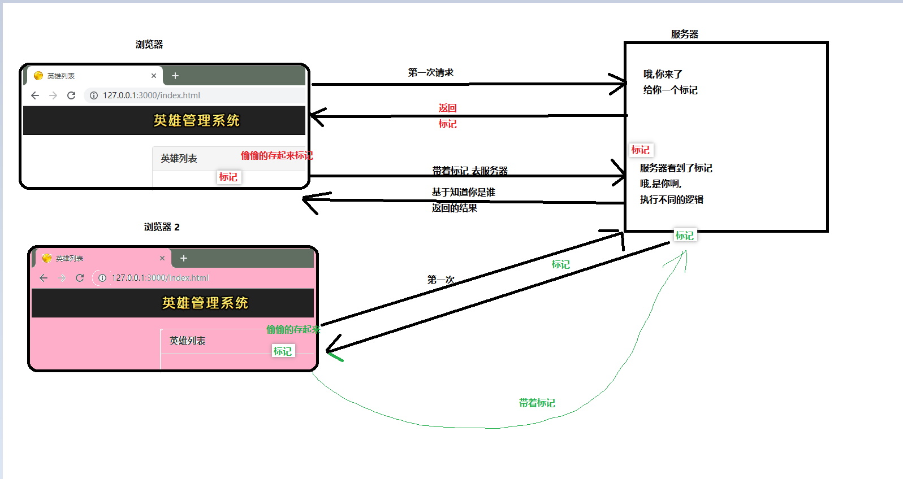
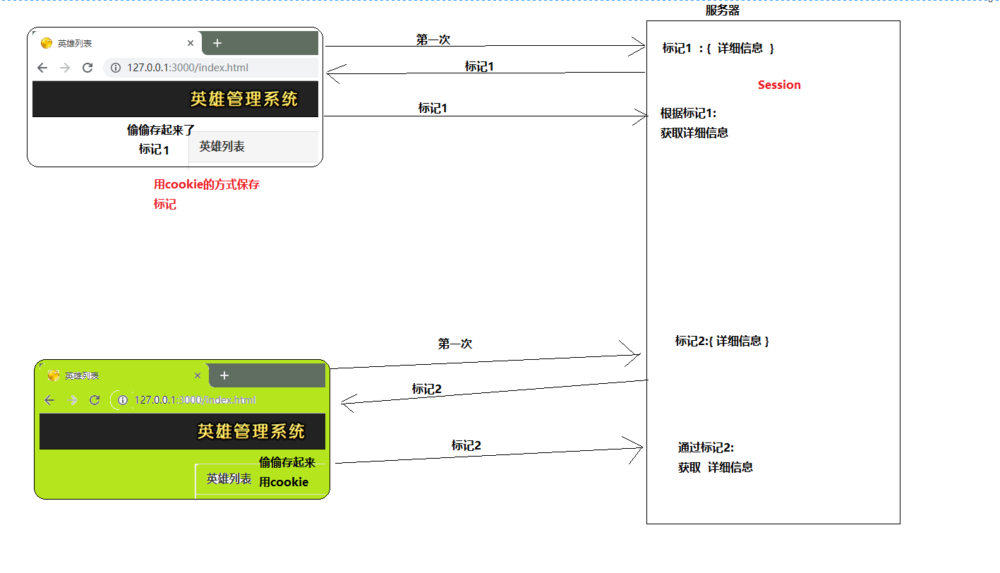
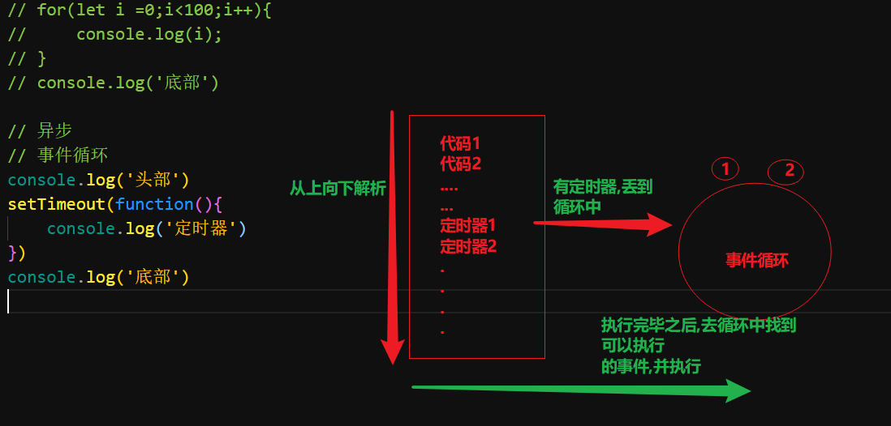

# Node.js - day06

## 回顾

1. 箭头函数

   ```javascript
   $('div').on('click','a',function(){
   	// 调用的时候确定
   	console.log(this); // a
   })
   
   // babel
   const that = this;
   $('div').on('click','a',()=>{
   	// 调用的时候确定
   	// console.log(this); // a
       console.log(that);
   })
   
   ```

2. 写接口:   写url和逻辑的对应关系

   1. 请求地址: 定义在后端的函数名

   2. 请求方法:获取(get)还是提交数据(post)

   3. 请求参数:函数需要的参数

   4. express中

      1. ```javascript
         app.post('地址',(req,res)=>{
         	// get
         	req.query
         	// post - 文本
         	req.body
         	// post - 文件
         	req.files
         })
         ```

      2. 

3. 调接口:调用定义在后端的函数

   1. 请求地址:文档`c+v`
   2. 请求方法:文档`c+v`
   3. 请求参数:要什么,传递什么
      1. `{ key:value,key2:value2 }`  纯文本
      2. `new FormData(form标签)` 有文件
         1. form表单中的表单元素的`name`属性,和服务器要的`key(参数)`

4. 打开页面:`http://127.0.0.1:3000/hero/list`

   1. ` [file:///C:/Users/hulinghao/Desktop/Node.js/Day06/04-%E6%BA%90%E4%BB%A3%E7%A0%81/heroManage/web/index.html](file:///C:/Users/hulinghao/Desktop/Node.js/Day06/04-源代码/heroManage/web/index.html) `
      1. 跨域,不可以
   2. ` http://127.0.0.1:5500/heroManage/web/index.html `
      1. 跨域,
      2. 浏览器自动补全了基地址,最终的完整地址不存在 `404`
   3. ` http://127.0.0.1:3000/index.html `
      1. 同源,

5. 接口测试工具

   1. 
   2. 
   3. 

## 用户模块 - 功能说明

> 不是谁都可以进来增删改查的哦,注册并登录之后才可以进入到管理页面

1. 用户注册
   1. 输入用户名,密码
   2. 点击注册
      1. 用户名已被注册
      2. 注册成功
2. 用户登录
   1. 输入用户名
   2. 输入密码
   3. 验证码:防止机器人恶意调用

## 用户模块 - 接口文档

> 有哪些需要提供的接口呢

| 服务器说明            | 作用描述                     |
| --------------------- | ---------------------------- |
| http://127.0.0.1:3000 | 服务器基地址                 |
| 200                   | 请求成功 状态码              |
| 401                   | 用户名已存在 或者 用户名错误 |
| 402                   | 密码 错误  或者  验证码错误  |
| 500                   | 服务器内部错误               |
| 302                   | 服务器重定向                 |

| 接口名称     | URL            | 请求方式 | 请求参数 | 返回值 |
| ------------ | -------------- | -------- | -------- | ------ |
| 用户注册     | /user/register |          |          |        |
| 查询英雄详情 | /user/login    |          |          |        |


## (后端)接口 - 用户注册

> 你首先得注册用户才可以登录哦

| 接口名称 | URL            | 请求方式 | 请求参数          | 返回值           |
| -------- | -------------- | -------- | ----------------- | ---------------- |
| 用户注册 | /user/register | post     | username,password | {code:200或,401} |

1. 建表

```javascript
//3.创建Model(表格模型：负责增删改查)
//如果table表格存在则连接，不存在则自动创建
const userModel = hm.model('user', {
  // 名字 字符串
  username: String,
  // 技能 字符串
  password: String,
});
```


```javascript
// (6)用户注册
app.post('/user/register',(req,res)=>{
    // 获取文本 req.body (username,password)
    // 查询是否已被注册(查询用户名)
    // 回调函数中 数据查完了
    // 存在 返回401 已被注册
    // 不存在
    // 新增数据(注册用户,username,password)
    // 回调函数中
    // 成功 提示注册成功
    // 失败 内部错误
})
```

注意:

1. 用户注册的本质是数据的新增
2. 新增之前有一个查询的操作
3. 判断用户名是否已经存在
   1. 只需要判断用户名
   2. 密码可以相同


## (前端)调用接口 - 用户注册

> 接口写好了就调用,如果有问题后端立刻修改 -- 联调(联合调试)

步骤:

1. 为注册绑定点击事件
2. 获取数据:用户名,密码,重复
   1. 密码不一致:提示用户
   2. 两次密码必须一致
   3. 调用接口
   4. $.ajax
      1. url:`/user/register`,
      2. type`post`,
      3. data:{username,password},
      4. success(backData)
         1. 已被注册 提示用户
         2. 注册成功 提示用户

注意:

1. 非空判断
2. 两次密码是否相同判断
   1. 防止`普通用户`的`恶意`调用
   2. 一定程度降低了服务器的性能消耗
3. 上面的判断通过之后,再调用接口
   1. 原因:后端可以做非空判断,一般后端也会做非空判断
   2. `高级用户`可以越过浏览器的限制,直接向服务器发请求
   3. `后端`绝对会在服务器的接口逻辑中对数据进行判断
   4. 工作中:后端去写

## (后端)接口 -  验证码

>验证码中的图片是用代码生成的哦

传送门:   https://www.npmjs.com/package/svg-captcha 

用img的src去调用验证码接口

| 接口名称 | URL           | 请求方式 | 请求参数 | 返回值     |
| -------- | ------------- | -------- | -------- | ---------- |
| 验证码   | /user/captcha | get      | 无       | 验证码图片 |

```javascript
// 为了后续可以使用验证码的值,声明全局变量
let captchaText = '';
// 验证码路由注册
app.get('/user/captcha',  (req, res)=>{
  const captcha = svgCaptcha.create();
  // req.session.captcha = captcha.text;
  // console.log(captcha.text);
  // 保存到全局变量中
  captchaText = captcha.text;
  // 设置返回的类型
  res.type('svg');
  // 设置状态为200 并返回
  res.status(200).send(captcha.data);
});
```

注意:

1. `img`的src调用接口只能`get`请求
2. 服务器:
   1. 生成一张图片并返回
   2. 偷偷的把图片中的文字保存起来
   3. 后续用户登录时,需要用到这个文字



## (后端)接口 - 用户登录

> 注册成功之后,就可以注册了哦,那么如何获取验证码中的值呢?

| 接口名称 | URL         | 请求方式 | 请求参数 | 返回值          |
| -------- | ----------- | -------- | -------- | --------------- |
| 用户登录 | /user/login |          |          | {code:200或402} |

```javascript
// (7)用户登录
app.post('/user/login', (req, res) => {
  // 接收数据 (username,password,captcha)
  // console.log(captchaText);
  const { username, password, captcha } = req.body;
  // 验证码判断 将用户提交的验证码和 服务器保存的验证码 对比
  if (captcha.toUpperCase() !== captchaText.toUpperCase()) {
    // 不相等 直接返回 验证码错误
    res.send({
      code: 402,
      msg: '验证码错误哦,你是机器人吗!滑稽'
    });
    return;
  }
  // 相等
  // 非空判断
  if (username === '' || password === '') {
    // 不相等 直接返回 验证码错误
    // 为空 提示用户
    res.send({
      code: 402,
      msg: '用户名或密码错误,你是机器人吗!滑稽'
    });
    return;
  }
  // 不为空 and连接两个条件
  // 查询数据 username password

  userModel.find(
    `username="${username}" and password="${password}"`,
    (err, result) => {
      // 查询成功(!err)
      if (!err) {
        // console.log(result);
        // 数组中有值 用户名和密码对的
        // 返回登录成功
        // 数组为空 用户名和密码有问题
        // 返回用户名或密码错误,提示用户
        if(result.length!=0){
          // 用户名和密码 正确
          res.send({
            code:200,
            msg:'登录成功咯'
          })
        }else{
          // 用户名或密码错误
          // 安全问题
          res.send({
            code:402,
            msg:'用户名 或 密码错误'
          })
        }
      } else {
        // 查询错误 500
        res.send({
          code: 500
        });
      }
    }
  );

  // res.send('/login');
});
```


注意:

1. 用户或密码错误的目的是出于安全考虑,不是后端做不到,只是他不做而已(`防止非用户去套密码`)
2. 用户名和密码正确的依据:
   1. 用这两个条件去查询数据,查出来了,对,查不出来,错误
3. 验证码:
   1. 默认是区分大小写的,
   2. 如何实现不区分:
      1. 保存的数据及提交的数据写了大小写
      2. 如果能够全部转为相同的 大写或者小写
4. 碰到了没有做过的需求,你要坚信:`他能做`

## (前端)调用接口 - 用户登录

> 接口写好了就调用,如果有问题后端立刻修改 -- 联调

步骤:

1. 生成验证
   1. `img`标签的`src`设置为验证码的接口地址`/user/captcha`
2. 为登录按钮绑定点击事件
   1. 非空判断
   2. 不为空 调用接口
      1. $.ajax
         1. url:'/user/login',
         2. type:'post',
         3. data:{username,password,captcha}
         4. success
            1. 成功
            2. 失败:402

注意:

1. 验证码:`img`设置`src`属性,返回一个图片
2. 提交数据时,基本上都会带上验证码的值
3. 成功之后,跳转地址

## (前端)调用接口 - 用户登录-验证码刷新

> 如果验证码看不清楚咋办呢?点击要可以刷新哦

步骤:

1. 
2. 为图片绑定点击事件
3. 生成新图片的本质,是重新请求验证码的地址
4. `img.src='/user/captcha'`
5. `img`两次设置的地址相同,浏览器就会认为图片没变,不发请求,直接使用缓存
   1. 解决方案:让浏览器认为图片变了-->改变地址
      1. `/user/captcha?随机值`
      2. 随机值:
         1. 随机数
         2. 时间戳:`1970 `至今的毫秒数


```javascript
    $(function () {
      // 生成验证码 不用写 代码 将地址设置给img的src即可

      $('.login').click(function () {
        // 取值 去空格
        const username = $('#username').val().trim();
        const password = $('#password').val().trim();
        const captcha = $('#captcha').val().trim();

        // 非空判断 前端判断
        if (username === '' || password === '' || captcha === '') {
          // 提示用户
          alert("小老弟,你内容没有写哦");
          return;
        }
        // 不为空
        $.ajax({
          url: "/user/login",
          type: "post",
          data: {
            username,
            password,
            captcha
          },
          success(backData) {
            // console.log(backData);
            if (backData.code == 200) {
              alert(backData.msg);
              // 去首页
              window.location.href = './index.html';
            } else {
              alert(backData.msg);
            }
          }
        })
      })

      // 点击生成新的验证码
      $('.vcode').click(function () {
        // 重新设置src即可
        $(this).attr('src',`/user/captcha?${Date.now()}`);
      })

    })
```


注意:

1. 对于`img`标签`src`不变,浏览器会直接使用缓存的图片
2. 避免缓存,使用在url的后面拼接上`?随机值`的方式
3. 时间戳,或者随机数
4. `url`后面`?`分隔的内容,不会被解析为地址解析为`查询字符串()`

## (前端)调用接口 - 密码加密

> 让密码的提交更加安全

 https://github.com/blueimp/JavaScript-MD5 

1. 数据库可能被通过`黑客手段` 窃取数据
2. 如果用户密码是`明文`保存,泄露之后,直接通过`用户名`和`密码`登录
3. 加密,让别人就算知道了也无法登录

加密:

1. 通过`某些算法`,把某个值,计算出一个新的结果
2. 这个新的结果,无法`反算回去`
3. `对称加密`,`非对称加密`,`AES`.....
4. 用一个比较简单的 无法反算的算法
   1. `md5`:最初的设计摘要算法,从一个数据中算出一些特征值
   2. 计算的结果无法反算,满足加密算法的特点,有一部分人用它来进行加密

5. 直接使现成的库即可

缺点:

1. 数据不变,加密的结果是相同的
2. 常见的数组,对应的`md5结果`不会变
3. 把常见的`md5`的值,都保存下来了`数据库`
4. md5解密,常见的是可以解密的
5. 为了安全,加密的时候,额外的增加一个值`加盐`
6. 额外的增加一个数据,任意值

```
md(加密的值,盐(额外的值))
```

## (前端)调用接口 - 密码加密 逻辑

步骤-注册页

1. 点击注册时,所有判断都完成时
2. 加密
3. 然后提交

步骤 - 登录页

1. 点击登录时,所有判断都完成时
2. 加密
3. 提交数据


注意:

1. 工作中如果用到了其他的加密算法,调用不同的函数
2. 数据库中保存的也是密文,泄露之后还是有一定的保障的

补充:

1. 很多网站忘记密码之后:
   1. 找回密码:有反算回来的算法,不安全
   2. 重设密码:没有反算回来的算法,安全性会高一些

## (后端)会话技术 - cookie(曲奇,甜饼)

> 保存在浏览器中的简略信息,容量很小4kb

1. http是无状态的:
2. cookie的作用,解决http不会记录客户端(用户信息)这个缺点
3. 服务器:食堂大妈
4. 浏览器:我们
5. 默认情况下,大妈不会记住你
6. 你要在自己身上记录一些东西,让他成为你的标记

注意:

1. cookie 由`服务器`设置
2. 浏览器`保存`
3. 浏览器会`偷偷的携带`到服务器
4. 容量4kb,大数据存不了



## (后端)会话技术 - session

> 浏览器中保存了一个钥匙,服务器中保存了具体的值



1. session保存的位置是:服务器
2. 格式是 key:value
3. 浏览器中保存了一个`cookie`(标记,钥匙)
4. 浏览器再次请求服务器时,自动携带标记去服务器,服务器就可以根据标记获取到对应的详细信息了
5. `session`理论上来说,可以存很多的东西

补充

1. 内存:
   1. 程序运行的时候,数据所在的位置
   2. 断电就没有了
   3. 用记事本写笔记,没有保存
2. 硬盘:
   1. 保存的数据关机还在
   2. 保存成文件之后,就会在硬盘常驻


## (补充) token

> 现在比较流行的状态维持方案

1. 占用服务器的内存,消耗性能,存满了,可能会重启
2. `cookie`,`session`都必须依赖于浏览器
3. 应用程序也需要保存状态,但是他们不支持`cookie`,`session`
4. 使用`token`这个技术来实现的
   1. `token`是有服务器生成,基于某种`加密算法`来生成
   2. 计算时,会用到用户的的一些信息,不同用户算出来的值,不相同
   3. 计算完毕之后,服务器直接返回给浏览器,服务器什么都不存
   4. 对服务器的性能消耗小
5. 基于`token`的状态维持
   1. `网站可以用`
   2. `app可以用`
   3. 服务器不需要存东西,服务器性能消耗小
6. 对于绝大多数公司
   1. app
   2. 网页
   3. 公众号
   4. 小程序

## (后端)接口 - 登录状态维持

> 登录之后,保存登录状态,方便后续验证

核心:

1. 用户登录成功之后,服务器需要保存`session`
2. 返回`cookie`给浏览器
3. `session`可以用来保存用户的信息,`用户名`

步骤:

1. 下包 : npm i express-session 
2. 导包
3. 用包
4. 登录成功之后保存信息即可
   1. 用户登录接口的
   2. 信息判断正确中
   3. `req.session.userInfo=查询出来的数据`
5. 登录成功之后记录`session`
6. 后续的接口逻辑中判断是否有值
   1. 有:正常执行
   2. 没有:去登陆

## (后端)express 中间件统一登录判断

1. index.js的顶部注册中间件
2. 通过地址约束`/hero/*`所有和英雄相关的逻辑必须登录才可以使用

```
// 自己写中间件
// 所有
app.use('/hero/*',(req, res, next) => {
  console.log(req.session);
  if (!req.session.userInfo) {
    console.log('竟然没登录');
    res.send({
      code:402,
      msg:'小样,没登录也想进来调用接口,滚蛋'
    })
  } else {
    // 向后执行
    next();
  }
});
```


## (后端)接口 - 退出登录

| 接口名称 | URL          | 请求方式 | 请求参数 | 返回值     |
| -------- | ------------ | -------- | -------- | ---------- |
| 用户退出 | /user/logout | get      | 无       | {code:200} |

步骤

1. 注册路由
2. 逻辑
   1. 删除session中的userInfo
   2. 如何删除对象中的属性:
      1. `delete` 
      2. 设置为空
      3. 返回提示信息给用户


注意:

1. 工作中如果是基于session的登录逻辑 前端不用干任何事
2. 基于token才需要保存和携带
3. 目前的趋势是越来越多的项目用`token`
4. 面试时:面试官挺喜欢问
   1. localStorage和sessionStorage的区别
      1. 前者关闭浏览器还在
      2. 后者关闭浏览器没有了
      3. 只能存字符串,如果要存复杂类型可以结合`json.stringify`
   2. localStorage和sessionStorage和cookie和session的区别
      1. cookie保存的位置是浏览器,自动保存,自动携带,容量小 4kb
      2. `session`保存的位置是服务器,浏览器用cookie存了一个`标记,钥匙噢`
      3. 服务器根据cookie携带而来的`标记`获取到详细的信息
      4. session消耗服务器的性能  我`之前的项目`用的是`token`
      5. 我和你说说`token`吧!
      6. .....
      7. axios中可以用拦截器统一设置token
      8. 在vue中用导航守卫统一判断是否有token
      9. 我们聊聊vue吧

## 同步 & 异步

1. 同步,从上向下依次执行
   1. 绝大多数都是同步
2. 异步,同时执行,某段代码的执行,不会阻塞后续代码
   1. 绝大多数的`异步代码`都伴随着回调函数
   2. 定时器,Ajax,
   3. fs.readFIle(path,(err,data)=>{})
   4. hmModel.find('',(err,result)=>{})
3. 

## echarts 基本使用

> 数据可视化,数据变成图标

1. 常见的,柱状图,饼状图,折线图,
2. k线图
3. 网页绘图
   1. 可以用html元素来绘制,非常不建议,
   2. `canvas`:
      1. 网页中推出的一套绘图api
      2. 画圆,画方,划线....
      3. 公司中
         1. 要么完全不用
         2. 要么用十分会用的牛人,甚至自己封装了一套
   3. `webgl`:
      1. 更接近与底层的绘图api
      2. 相比`canvas`性能更好,
4. 图形化绘制:
   1. 不需要自己学习整套api
   2. 用现成的即可: https://www.echartsjs.com/zh/index.html 
5. echarts:公司使用
   1. 重度使用:大量用到了数据可视化,各种配置都可能会用到
      1. 招聘要求中,明确要求你会`echarts`
   2. 轻度使用:产品经理发现要用的时候,先去`echarts`的官网看看有没有示例,有就用
      1. 随用随看
   3. 大伙不需要花大量的经历在上面
6. 入门方式:
   1. 找示例
   2. 修改内部的代码,看效果
   3. 去配置项中确认效果
   4. 公司中需要大量用到这个

## 大事件  & Node.js总结

> 大事件和Node.js的重点内容是什么呢?

### 大事件:

   1. 前台页面:给普通用户看内容的页面

   2. 后台页面:给网站管理员维护网站数据的(`编辑`)

   3. 工作中项目的开发方式:

      1. 开始编码时:
         1. 接口文档,
         2. 原型图;带交互的,没有逻辑
         3. 视觉设计图:最终要做成的效果(1:1还原)

   4. 大事件重点练习调接口

      1. 增: post +数据
      2. 删:post +数据
      3. 改:post +数据
      4. 查:get +数据(可选)

   5. 登录状态:`token`

      1. 登录成功.服务器返回
      2. 程序员自己保存`localStorage`
      3. 后续接口:`header`中传递`token`
      4. 抽取到jQ的底部

   6. 为了防止接口地址修改,

      1. 抽取到`沙箱`jQ底部

      2. ```js
         (function(w){
         	// 
         	
         	w.xx =xx;
         
         })(window)
         
         
         ```

   7. 增删改查

      1. get:$.ajax({url,data,success})
      2. post文本 $.ajax({url,type:post,data,success})
      3. post文件$.ajax
         1. formData创建时,自动获取有name的表单元素的value值,
         2. 没有需要人为的`append(key,值)`
         3. processData:false
         4. contentType:false
         5. data:formData
         6. success

   8. 批量数据渲染:

      1. 模板引擎:
         1. 导包
         2. 定义模板,挖坑
         3. 填充,模板 
      
   9. 动态生成的元素,用委托
   
      1. `$().on('click')`
   
   10. 插件使用
   
       1. `c+v`跑起来先
       2. 根据需求改设置,结合文档
       3. 心态转变:
          1. 初期:必须背下来才能用
          2. 文档应该是对的,
          3. 中期:`c+v`贼溜一把梭
          4. 后期:可以去研究原理
             1. 很多原理性的东西,到了一定的地步,


### Node.js

1. 服务端的js

      1. EcmaScript:基础语法
      2. 模块:
         1. 内置:功能强大,用起来麻烦
         2. 第三方:功能强大,用起来简单
      3. 从浏览器中学习下来的api
         1. console
         2. 定时器
2. 浏览器端的js

   1. ECMAScript
   2. Bom
   3. Dom
   4. ES6:2015年推出的新标准,普遍兼容

      1. 用更简单的语法,干更多的事
      2. let,const
      3. {name,age}
      4. ()=>{} this是创建时确定了
3. `node.js`
   1. 静态资源服务器
      1. 获取url
      2. 生成路径
      3. 读取并返回
   2. `express`
      1. 一行搞定静态资源服务器
      2. 写接口
      3. 注册路由:
         1. url和后台逻辑的对应关系
      4. 调用接口:
         1. 调用后端定义的函数
         2. url:函数名
         3. 参数:函数的形参
         4. 返回结果:函数的返回值
      5. 接口
         1. 接口文档

            1. 约定了前端的调用形式
            2. 约定了后端的实现形式
            3. 接口的内部逻辑
               1. 操纵数据
                  1. 增
                  2. 删
                  3. 改
                  4. 查
      6. 数据库的数据
         1. mysql基本使用
         2. 建库,建表,字段
         3. `sql``
         4. ``orm`用操纵对象的方式去操纵数据 节省时间


